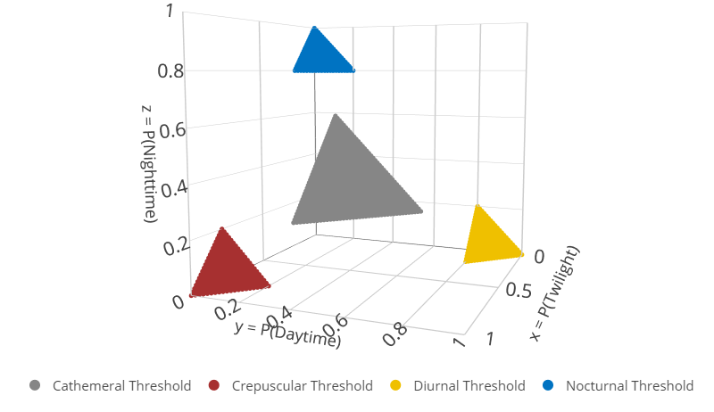
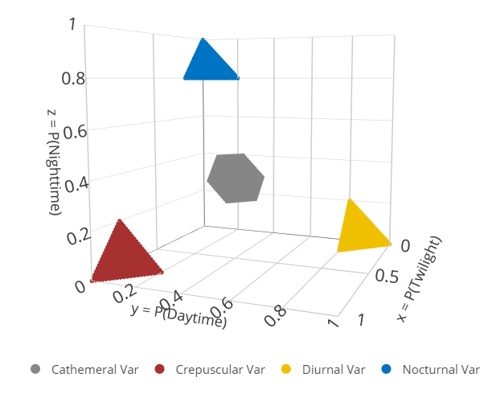
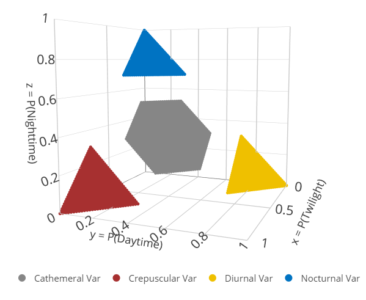
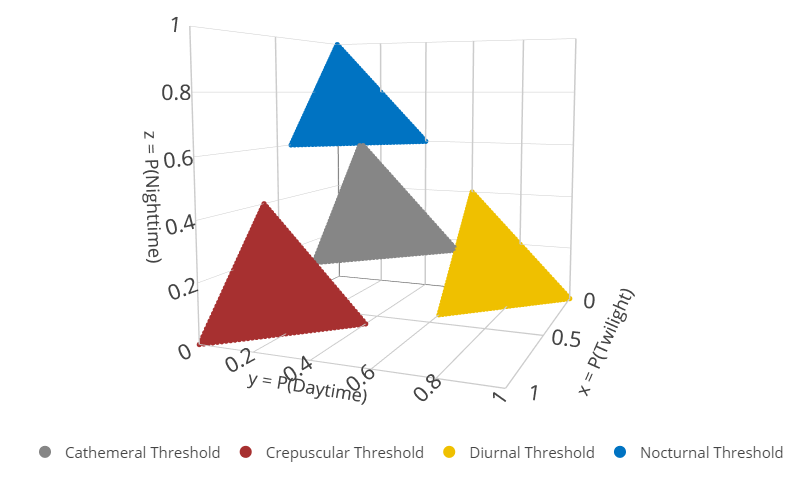

# Additional Package Details

We include some more details about the $\texttt{Diel.Niche}$ package.
For the fundamental uses, see the main vignette (’Diel-Niche-vignette).

# Hypotheses

Along with the three main hypotheses sets (*Maximizing*, *Traditioanl*,
and *General*), we have two additional sets. These sets are importantly
different in that the entire parameter space is not defined. They are
also defined a bit differently.

**Threshold**

This hypothesis set is based on defining each diel period in terms of
lower thresholds. If the thresholds are not provided, default values are
used.

``` r
triplot(hyp=hyp.sets("Threshold"))
```



The blank space in this figure indicates that these probabilities are
not considered as art of the parameter space. Therefore, when using this
hypothesis set you are deciding that these combinations of parameter
values can not occur. To control this threshold probability via the
`diel.ineq()` function you would want to modify `xi.t.D`, `xi.t.N`,
`xi.t.CR`, and `xi.t.C`.

This specific hypothesis set might be used because of the difficultly in
estimating a given diel phenotype when the probabilities are at the
boundaries of a given hypothesis. However, We do not encourage the use
of this hypothesis set to falsely increase the precision of your
estimates. Instead, this hypothesis set could be used if aligns with the
natural history of a given species.

**Variation**

This hypothesis set is based on defining the ranges (lower, upper) of
possible probability values.

``` r
triplot(hyp=hyp.sets("Variation"))
```



# User-modified Hypotheses

You do not need to rely on pre-set definitions of diel hypotheses. If
you are interested in categorizing dominant diel phenotypes based on
0.90 probability or higher, you can adjust the hypotheses using the
function ‘diel.ineq()’ than pass this object to the plot function or
model fitting function. Here, we will just define the lower bount of
each diurnal, nocturnal, and crepuscular using $\xi_{1} = 0.90$

``` r
  diel.setup=diel.ineq(xi = c(0.90))
#> Warning in diel.ineq(xi = c(0.9)): length(xi) == 1 when it should be 2.
#> Calculated the second value as (1 - xi)/2,
#> where xi is the single value you provided.
  triplot(hyp=hyp.sets("Traditional"),diel.setup=diel.setup)
```


If you want to separate the hypotheses and reduce the parameter space of
cathemerality,

``` r
  diel.setup=diel.ineq(xi = 0.70,separation=0.10)
#> Warning in diel.ineq(xi = 0.7, separation = 0.1): length(xi) == 1 when it should be 2.
#> Calculated the second value as (1 - xi)/2,
#> where xi is the single value you provided.
  triplot(hyp=hyp.sets("Traditional"),diel.setup=diel.setup)
```


When considering the General hypothesis set, you can adjust the lower
threshold probability value ($\xi_{1}$) to define crepuscular, diurnal,
and nocturnal, as well as adjust the definitions of Cathemeral General
vs Diurnal-Nocturnal, Crepuscular-Nocturnal, and Diurnal-Crepuscular
($\xi_{2}$). To do this, set $xi$ as a vector of two probabilities,

``` r
  diel.setup=diel.ineq(xi = c(0.9,0.05))
  triplot(hyp=hyp.sets("General"),diel.setup=diel.setup)
```


This new hypothesis set can be used to simulate data and fit the same
models by passing the object diel.setup as an attribute of the functions
sim.diel and diel.fit.

``` r

y=sim.diel(hyp="D.CR",n.sample = 200,diel.setup=diel.setup)$y

out = diel.fit(y,hyp.set=hyp.sets("General"),n.chains=2,post.fit = TRUE,diel.setup=diel.setup)
#> Data checks Complete.
#> Calculating Bayes Factors...
#> Posterior Sampling...
#> The most supported model is: 
#>  Diurnal-Crepuscular (General)

triplot(out)
```


There are additional defaults that could be changed, depending on your
hypotheses of interest.

``` r
#To see all the default inputs
  defaults=diel.ineq()
  defaults$inputs
#> $e.D
#> [1] 0.05
#> 
#> $e.N
#> [1] 0.05
#> 
#> $e.CR
#> [1] 0.05
#> 
#> $e.EC
#> [1] 0.05
#> 
#> $e.AV
#> [1] 0.1
#> 
#> $xi.t.D
#> [1] 0.8
#> 
#> $xi.t.N
#> [1] 0.8
#> 
#> $xi.t.CR
#> [1] 0.8
#> 
#> $xi.t.C
#> [1] 0.2
#> 
#> $eta.D
#> [1] 0.9
#> 
#> $eta.N
#> [1] 0.9
#> 
#> $eta.CR
#> [1] 0.9
#> 
#> $eta.C
#> [1] 0.333
#> 
#> $xi
#> [1] 0.8 0.1
#> 
#> $p.avail
#> [1] 0.1666660 0.4166667
#> 
#> $separation
#> [1] 0
```

For the **Variation** hypotheses, we can adjust the range of values for
all hypotheses as,

``` r

# Default
  triplot(hyp =hyp.sets("Variation"))
```




``` r

# New
  triplot(hyp =hyp.sets("Variation"),diel.setup=diel.ineq(e = 0.2))
```


``` r

  
# You can change individual hypotheses as well. Here, we are changing the range of the diurnal hypothesis only. This is not recommend. But, there is flexibility to be creative.

  triplot(hyp =hyp.sets("Variation"),diel.setup=diel.ineq(e.D = 0.4))
```


For the **Threshold** hypotheses, we can adjust the lower probability
similarly as,

``` r
  
# Default
  triplot(hyp =hyp.sets("Threshold"))
```


``` r

# Adjusted

  triplot(
    hyp =hyp.sets("Threshold"),
    diel.setup=diel.ineq(
      xi.t.D = 0.6, xi.t.N = 0.6, xi.t.CR = 0.6
    )
  )
```




# User-specified Hypotheses

Next, we will demonstrate how to include additional diel hypotheses.
This requires understanding the inequality constraint setup and then
coding the results as additions to the ‘diel.ineq’ output. Let’s
consider two complementary hypotheses that account for the complete
parameter space among the three fundamental probabilities. Our objective
is to evaluate whether an animal is highly crepuscular or not. We will
define highly crepuscular as $p_{tw} \geq 0.5$. The complementing
hypothesis is that the animal does not have such high crepuscular
activity $p_{tw} < 0.5$.

## Hypothesis 1 Inequalities

$$
\begin{equation} 
\begin{split}
& p_{\text{tw}} \geq 0.5 \\
\end{split}
\end{equation}
$$

Next, we need to translate each inequality into the framework of
$\mathbf{A} \boldsymbol{\theta} \leq \mathbf{b}$.

$$
\begin{equation} 
\begin{split}
& p_{\text{tw}} \geq 0.50 \\
& -p_{\text{tw}} \leq -0.50 \\
& (-1) \times p_{\text{tw}} + (0)\times p_{\text{d}} \leq -0.50 \\
\end{split}
\end{equation}
$$ Putting it together, we take the constants in parentheses left of the
equal sign and package it into matrix $\mathbf{A}$ and take the
constants on the right of the equal sign and package it into vector
$\mathbf{b}$ as,

$$
\begin{equation} 
\textbf{A} = \begin{bmatrix}
-1 & 0 \\
\end{bmatrix}, \textbf{b} = \begin{bmatrix} -0.50 \\ \end{bmatrix}.
\end{equation}
$$

## Hypothesis 2 Inequalities

The complementing low activity during twilight as,

$$
\begin{equation} 
\begin{split}
& p_{\text{tw}} \leq 0.49999 \\
\end{split}
\end{equation}
$$ Following the same procedure, we find that,

$$
\begin{equation} 
\textbf{A} = \begin{bmatrix}
1 & 0 \\
\end{bmatrix}, \textbf{b} = \begin{bmatrix} 0.49999 \end{bmatrix}.
\end{equation}
$$ \## Coding

Now, we need to code these hypotheses into $\texttt{Diel.Niche}$

``` r
# First, we need to create new list elements. One for each new hypothesis, with these ordered elements in each list,

# Element 1: Name 
# Element 2:  A
# Element 3:  b
# Element 4:  func

# Note, func - this should almost always be 'bf_multinom', unless an equality statement is specified, which required function 'bf_equality'

  A <- matrix(c(-1,0),ncol = 2, byrow = TRUE)
  b <- c(-0.5)
  New1=list(Name="Highly Crepuscular",A=A,b=b,func="bf_multinom")  

  A <- matrix(c(1,0),ncol = 2, byrow = TRUE)
  b <- c(0.49999)
  New2=list(Name="Not highly Crepuscular",A=A,b=b,func="bf_multinom")  

#Second, include these new lists into diel.ineq() function as,
  
  diel.setup=diel.ineq()
  diel.setup$New1=New1
  diel.setup$New2=New2
```

We have setup our hypotheses. Now, we need to visualize them to check
it’s what we intended. Note that in each following, we pass our new
diel.setup object to each function.

``` r
triplot(hyp=c("New1","New2"),diel.setup = diel.setup,more.points = TRUE)
```


### Simulating and Fitting

Let’s simulate data under the hypothesis that the animal is highly
crepuscular.

``` r
set.seed(43243)
dat=sim.diel(n.sample=85, hyp="New1",diel.setup = diel.setup)
y=dat$y
y
#>      y_crep y_day y_night
#> [1,]     61    22       2
```

Next, let’s compare our two models

``` r
#Note, that we get a warning, which is fine
out <- diel.fit(y, hyp.set = c("New1","New2"),diel.setup=diel.setup)
#> Data checks Complete.
#> Calculating Bayes Factors...
#> Warning in full.hyp.name(ms.model): Hypothesis code is not recognized
#> The most supported model is: 
#>  New1

#Let's look at the model probabilities, where we find the model we simulated is highly supported
out$bf.table
#>      Prior Posterior
#> New1   0.5         1
#> New2   0.5         0
```

# Additional Hypotheses

We have included a few additional hypotheses that could be useful but
don’t fit nicely into a hypothesis set that is only made up of mutually
exclusive hypotheses. This generally means that larger sample sizes will
be needed to identify them as most supported within a set.

## Even Cathemarlity

A strict definition of cathemerality is that there is even amount of
activity in all thre diel periods. Thus, the probabilities of activity
of twilight, day, and night are all equal. We can consider this model by
simulating data under this model and considering a combination of the
Traditional hyptheses set and the even cathemarlity hypothesis(‘EC’).

``` r
set.seed(5452)
dat = sim.diel(n.sim=1, n.sample=100, hyp="EC")

y=dat$y

out = diel.fit(y, hyp.set=c(hyp.sets("Traditional"),"EC"), post.fit = TRUE)
#> Data checks Complete.
#> Calculating Bayes Factors...
#> Posterior Sampling...
#> The most supported model is: 
#>  Even Cathemeral Equality

out$bf.table
#>    Prior  Posterior
#> D    0.2 0.00000000
#> N    0.2 0.00000000
#> CR   0.2 0.00000000
#> C    0.2 0.02832742
#> EC   0.2 0.97167258

#Notice how small the parameter space is for the posteriors
triplot(out)
```


