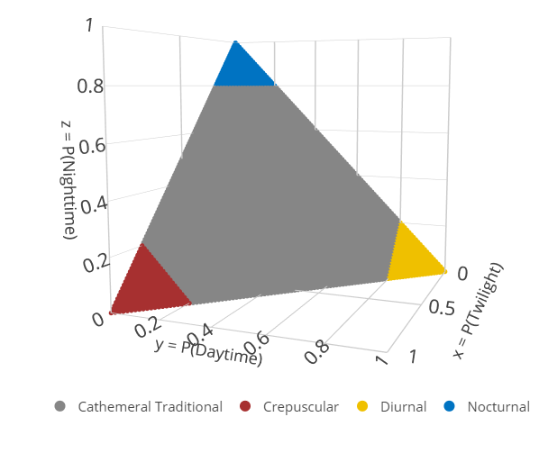
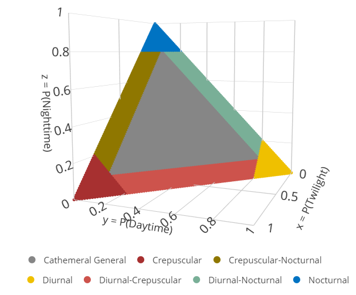
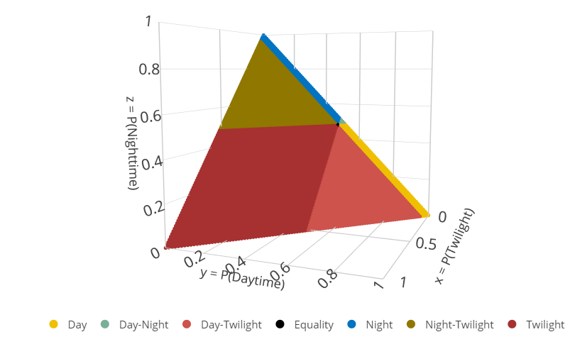
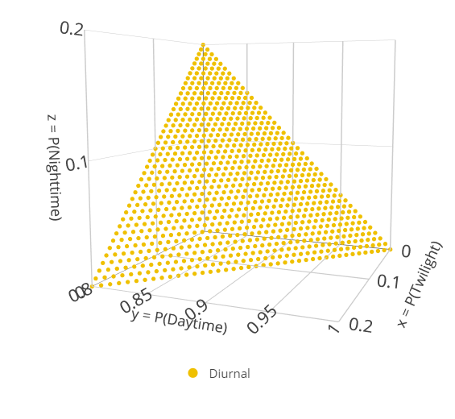

#### Authors: Brian Gerber & Mason Fidino

#### Date: 2023-06-15

# Introduction

The $\texttt{Diel.Niche}$ package is used to evaluate how animals use
the three fundamental periods of light: twilight (dawn & dusk), daytime,
and nighttime. First, install and load the library

The packages specifies many diel hypotheses, which together are defined
into six hypothesis sets. The code names for the hypotheses and sets
are,

``` r
what.hyp()
#> Traditional :  D N CR C  
#> 
#>  General :  D N CR C2 D.CR D.N CR.N 
#>  
#>  Threshold :  D.th N.th CR.th C.th 
#>  
#>  Maximizing:  D.max N.max CR.max 
#>  
#>  Variation:  D.var N.var CR.var C.var 
#>  
#>  Selection:  D.avail TW.avail N.avail EQ.avail D.TW.avail N.TW.avail D.N.avail 
#> 
```

A short description of each hypothesis within a given set is available
by calling it within the `what.hyp()` function. For example, `"CR"`
represents the `General Crepuscular` hypothesis within the `Traditional`
hypothesis set.

``` r
  what.hyp("CR")
#> [1] "Traditional/General Crepuscular"
```

To list all of the hypotheses of a given set you can use `hyp.sets()`

``` r
  hyp.sets("Traditional")
#> [1] "D"  "N"  "CR" "C"

  hyp.sets("General")
#> [1] "D"    "N"    "CR"   "C2"   "D.CR" "D.N"  "CR.N"
```

The best way to understand each hypothesis set is by plotting them. Of
the six currently available hypothesis sets within `Diel.Niche`, we
consider four of them as different fundamental ways to investigate how a
species uses diel time, which includes the Maximizing, Traditional,
General, and Selection sets. We have left out the Variation and
Threshold hypothesis sets from this vignette, but if you are interested
in those you can read about themn in the `Diel-Niche-Additional`
vignette.

## **Maximizing**

This hypothesis set includes three hypotheses \[Crepuscular Max
(`CR.Max`), Diurnal Max (`D.Max`), and Nocturnal Max (`N.Max`)\] with
the objective to evaluate which time period is used most. As such, there
is no hypothesis about activity across multiple time periods (i.e.,
cathemeral). To plot this, or any of the currently available hypothesis
sets within `Diel.Niche`, you can use the `triplot()` function.

``` r
triplot(
  hyp = hyp.sets(
    "Maximizing"
  )
)
```


Because `Diel.Niche()` quantifies how a species uses three separate diel
periods (twilight, day, and night), `triplot()` plots the proportion of
time a species may use each period on a three dimensional plot with the
`plotly()` package. If you use `RStudio` and are having issues seeing
plots from `triplot()`, go to the bottom of this vignette.

Hovering over the figure generated via `triplot()` shows the proportion
of time a species could use each diel period to possibly be classified
under a given hypothesis. For example, if the proportion of time a
species uses daytime (the y axis) is \> 0.5, then the Diurnal Max
(`D.max`) would likely be the most supported hypothesis (depending on
sample size).

## **Traditional**

This hypothesis set includes four hypotheses \[Crepuscular (`CR`),
Diurnal (`D`), Nocturnal (`N`), Traditional Cathemeral (`C`)\] that aim
to capture the general interpretation of these hypotheses from the
literature. Crepuscular, Diurnal, and Nocturnal are defined based on
having at least 0.80 probability (threshold probability,
$\xi_{1} = 0.80)$ in their respective diel periods (twilight, daytime,
nighttime). If an animal is not mostly active in one period than it is
defined as Traditional Cathemeral; this occurs when either two or three
time periods are used more than $1-\xi_{1}$. The logic behind the
threshold of 0.80 is that an animal uses a clear majority of time in one
diel period, but is not so strict that there is not some moderate amount
of activity outside of this period. While this is the default value we
set for the traditional hypothesis set in $\texttt{Diel.Niche}$, it can
easily be modified by a user when fitting these hypotheses to their data
(see below).

``` r
triplot(
  hyp = hyp.sets(
    "Traditional"
  )
)
```


## **General**

This hypothesis set includes seven hypotheses. The Diurnal (`D`),
Crepuscular (`CR`), and Nocturnal (`N`) hypotheses are defined the same
as in Traditional. The main difference is the separation of the
probability space of Traditional Cathemeral into four more specific
hypotheses: General Cathemeral (`C2`), Crepuscular-Nocturnal (`CR.N`),
Diurnal-Nocturnal (`D.N`), and Diurnal-Crepuscular (`D.CR`). The General
Cathemeral hypothesis (`C2`)—which represents a subset of the parameter
space taken by the previously mentioned Traditional Cathemeral
(`C`)—aims to define when an animal uses all three diel periods
(twilight, daytime, nighttime) at equal to or more than a minimum amount
(i.e., $p_{\text{tw}}, p_{\text{d}}, p_{\text{n}} \leq \xi_{1}$ and
$p_{\text{tw}}, p_{\text{d}}, p_{\text{n}} \geq \xi_{2}$). We defined
the lower threshold probability as $\xi_{2} = 0.10$, such that we
consider it important to differentiate animal activity when a diel
period is used at least this much. However, if only two diel periods are
used above $\xi_{2}$ then we classify this activity using one of the
binomial hypotheses (Crepuscular-Nocturnal, Diurnal-Nocturnal, and
Diurnal-Crepuscular).

``` r
triplot(
  hyp = hyp.sets(
    "General"
  )
)
```



For example, suppose a species is active mainly during the day with
$p_{\text{d}} = 0.78$, relatively active during twilight with
$p_{\text{tw}} = 0.16$, and not very active at night with
$p_{\text{n}} = 0.06$. We would define this activity as
Diurnal-Crepuscular because $p_{\text{tw}}$ &
$p_{\text{d}} \geq \xi_{2}$, while $p_{\text{n}} < \xi_{2}$. However, if
night activity was also higher than $\xi_{2}$, such that
$p_{\text{d}} = 0.70$, and $p_{\text{tw}} = p_{\text{n}} = 0.15$ then we
classify this activity as General Cathemeral because a moderate to large
amount of activity occurs in all three diel periods. In summary, the
Traditional hypothesis set distinguishes between unimodal and
multi-modal diel activity, while the General set distinguishes among
unimodal, bimodal, and trimodal activity.

**Selection**

This hypothesis set includes seven diel phenotype hypotheses and are
defined based on an inputted amount of proportional time available to an
animal in each diel period
($\mathbf{p}_{\text{avail}} = [p_{av.tw},\;p_{av.d}]$). The available
time in the night period does not need to be input as it is derived as
$1 - p_{av.tw}, - p_{av.d}]$.

The hypotheses in this set are Day Selection (`D.avail`), Twilight
Selection (`TW.avail`), Night Selection (`N.avail`), use equivalent to
availability (`EQ.avail`), Day-Twilight Selection (`D.TW.avail`),
Night-Twilight Selection (`N.TW.avail`), and Day-Night Selection
(`D.N.avail`). Unlike the other hypothesis sets that aim to quantify the
dominant time periods a species uses, the selection hypothesis set
quantifies if a species uses a given diel period more than it is
available.

One specific component that is important to consider with this
hypothesis set is that the amount of time available in each diel period
changes based on the day of the year and location, and can be calculated
with relative ease with the `suncalc` package in R.

First, let’s plot where day and night have equal availability as,

``` r
triplot(
  hyp = hyp.sets(
    "Selection"
  ),
  diel.setup = diel.ineq(
    p.avail = c(0.04,0.48)
  )
)
```




We can see the hypotheses change when we make an increasing amount of
available time in the night period, such as during winter in the higher
latitude areas,

``` r
triplot(
  hyp = hyp.sets(
    "Selection"
  ),
  diel.setup = diel.ineq(
    p.avail = c(0.04,0.3)
  )
)
```


Because of the shift in availability throughout a year, researchers may
want to discretize longer time periods into smaller pieces to determine
if selection varies, for example, over the course of a year.

# Plotting a single hypothesis

You can also use `triplot` to also view specific hypotheses. For
example, to plot out the Traditional diurnal hypothesis you would run

``` r
triplot(
  hyp = "D",
  more.points = TRUE
)
```




Note that while this looks like a full triangle, the axes are quite
different ( i.e., this is zoomed in on the part of the diel parameter
space that is associated to this hypothesis within the traditional
hypothesis set ). Because this is a zoomed in look at one hypothesis, we
set the `more.points` argument to `TRUE` in order to better fill in the
space to view it.

# Simulating Data

To simulate data based on a diel hypothesis, we need define a hypothesis
using its coded name. Pick a hypothesis to simulate data from and how
many samples.

``` r
  set.seed(45451)
  hyp <- c("CR")
  sim <- sim.diel(
    hyp = hyp,
    n.sample = 100
  )
  
  #The probability value used to simulate data
  (p <- sim$p)
#>       [,1]  [,2] [,3]
#> [1,] 0.855 0.025 0.12
  
  #The simulated data
  (y <- sim$y)
#>      y_crep y_day y_night
#> [1,]     89     1      10
```

# Setup hypothesis set and fit models

You can setup your own model set by creating a vector of coded
hypothesis names or use the pre-defined model sets. In general, we
suggest using all of the hypothesis within a given set instead of a
handful of them, but `Diel.Niche` can be used both ways.

``` r
#Manual 
  hyp.set <- c("D","CR") 
  
#Pre-defined
  hyp.set <- hyp.sets("Traditional")
```

To fit the data to the hypothesis set using default and equal priors for
each model set, all you need to do is supply the data and which
hypothesis to fit to `diel.fit()`. Furthermore, the Bayes factors table
(`bf.table`) can be accessed to check out the posterior probability of
support for each hypothesis given the data.

``` r
  out <- diel.fit(
    y,
    hyp.set = hyp.sets(
      "Traditional"
    )
  )
#> Data checks Complete.
#> Calculating Bayes Factors...
#> The most supported model is: 
#>  Crepuscular (Traditional)

#Call the model probabilities for each hypothesis in the set
  out$bf.table
#>    Prior   Posterior
#> D   0.25 0.000000000
#> N   0.25 0.000000000
#> CR  0.25 0.998817404
#> C   0.25 0.001182596
```

In this case, the support for `CR` is almost 1, which makes sense as we
simulated data under that hypothesis for this example.

The returned diel list object has numerous named elements, all of which
are detailed in the help file for `diel.fit`

``` r
attributes(out)

?diel.fit
```

    #> $names
    #>  [1] "bf.table"           "post.samp"          "ms.model"           "ppc"                "ms.ppc"             "post.samp.ms.model" "y"                 
    #>  [8] "y.vec"              "gelm.diag"          "ms.gelm.diag"       "bf.list"            "diel.setup"         "hyp.set"           
    #> 
    #> $class
    #> [1] "list" "diel"

The function `diel.fit` defaults to providing the model probabilities
for each hypothesis set, but not the posterior samples of the parameters
for each hypothesis. If you would like the posterior MCMC samples, which
can be useful for plotting purposes and model reporting, you can change
the `post.fit` argument to `TRUE`. Futthermore, if you would like to
assess model convergence then multiple chains are necessary. This can be
modified by chaning the `n.chains` argument

``` r
  out <-  diel.fit(
    y,
    hyp.set = hyp.sets("Traditional"),
    n.chains = 2,
    post.fit = TRUE
  )
#> Data checks Complete.
#> Calculating Bayes Factors...
#> Posterior Sampling...
#> The most supported model is: 
#>  Crepuscular (Traditional)
```

We can look at a convergence criteria for each hypothesis. Note that
convergence can be very poor for models that do not meet the inequality
constraints well. As, such, we highly suggest running these models on
multiple chains and ensuring that the best fit model has converged.

``` r
  out$gelm.diag
#> $D
#> Potential scale reduction factors:
#> 
#>      Point est. Upper C.I.
#> p1_1          1       1.00
#> p1_2          1       1.01
#> 
#> 
#> $N
#> Potential scale reduction factors:
#> 
#>      Point est. Upper C.I.
#> p1_1        NaN        NaN
#> p1_2          1          1
#> 
#> 
#> $CR
#> Potential scale reduction factors:
#> 
#>      Point est. Upper C.I.
#> p1_1          1          1
#> p1_2          1          1
#> 
#> 
#> $C
#> Potential scale reduction factors:
#> 
#>      Point est. Upper C.I.
#> p1_1          1       1.00
#> p1_2          1       1.01
```

In this example, the Nocturnal model had issues with estimating
`p_crep_1` (Probability of crespuscular actvity). More specifically, the
Nocturnal model estimated it as zero across both chains, making it
impossible to compute a gelman diagnostic. Regardless, this ‘lack of
convergence’ as specified by this diagnostic should have little effect
on the calculation of the Bayes factors, so there is no need to remove
the Nocturnal model from this set. What this does mean, however, is that
inference should not be made from the Nocturnal model.

We can plot the posterior samples from the most supported model to check
convergence/mixing as well. You can access the posterior of the best fit
model via `post.samp.ms.model`.

``` r
plot(
  coda::as.mcmc(out$post.samp.ms.model)
)
```

<!-- -->

The posterior samples for all hypotheses are available in a list.

``` r
names(
   out$post.samp
)
#> [1] "D"  "N"  "CR" "C"

#For each of these list is a list of chains
length(out$post.samp[[1]])
#> [1] 2

#Here are the means of the posterior samples of all hypotheses for chain 1
lapply(
  out$post.samp,FUN = function(x){colMeans(x[[1]])}
)
#> $D
#>   p_crep_1    p_day_1  p_night_1 
#> 0.17657962 0.80198005 0.02144033 
#> 
#> $N
#>  p_crep_1   p_day_1 p_night_1 
#> 0.0000000 0.1059628 0.8940372 
#> 
#> $CR
#>   p_crep_1    p_day_1  p_night_1 
#> 0.87502751 0.01908273 0.10588976 
#> 
#> $C
#>   p_crep_1    p_day_1  p_night_1 
#> 0.78442782 0.03272848 0.18284371
```

# Plotting

Using the packages bayesplot and ggplot2, we can examine our posterior
distributions along with the true probabilities values used to simulate
the data for this example.

``` r
library(ggplot2)
library(bayesplot)

posteriors <- coda::as.mcmc(
  out$post.samp.ms.model
)

plot_title <- ggplot2::ggtitle(
  "Posterior distributions",
  "with medians and 80% intervals"
)
bayesplot::mcmc_areas(
  posteriors, prob = 0.8
  ) + 
  plot_title + 
  ggplot2::geom_vline(
    xintercept = p[1],
    linetype="dashed",
    color = c("red"),
    size = 1
  ) +
  ggplot2::geom_vline(
    xintercept = p[2],
    linetype="dashed",
    color = c("purple"),
    size = 1
  ) +
  ggplot2::geom_vline(
    xintercept = p[3],
    linetype="dashed",
    color = c("green"),
    size = 1
  )
```


Another way to examine our hypothesis is to plot the theoretical niche
space for the hypothesis along with the posterior samples from the most
supported model. To add the posterior samples you just need to provide
them to the `posteriors` argument. First, let’s plot the posterior
samples out on the most supported model

``` r
triplot(
  hyp = out$ms.model,
  more.points = TRUE,
  posteriors = out$post.samp.ms.model
)
```


Or we can plot the posteriors out on the whole hypothesis set. Unlike
the previous plot this is done by default if you supply the fitted diel
list object.

``` r
triplot(out)
```


# The Unconstrained Model

If you are interested in comparing the constrained hypotheses to an
unconstrained model, you can do that by adding it into the hypothesis
set

``` r
hyp.set.new <- c(
  hyp.sets("General"),
  "Uncon"
)
out <- diel.fit(
  y,
  hyp.set = hyp.set.new,
  n.chains = 2,
  post.fit = FALSE
)
#> Data checks Complete.
#> Calculating Bayes Factors...
#> The most supported model is: 
#>  Crepuscular (Traditional)

#Compare the uncosntrained model to the rest of the models of the General hypothesis set
out$bf.table
#>       Prior  Posterior
#> D     0.125 0.00000000
#> N     0.125 0.00000000
#> CR    0.125 0.96116592
#> C2    0.125 0.00000000
#> D.CR  0.125 0.00000000
#> D.N   0.125 0.00000000
#> CR.N  0.125 0.00519491
#> Uncon 0.125 0.03363917
```

# Data availabilty and an unequal prior

The package includes a set of available data that can be accessed as

``` r
data(diel.data)
head(diel.data)
#>           scientificName twilight day night trap_nights nsite  min_date max_date mean_lat mean_lon season       country   phylum    class           order
#> 1          Canis latrans        6  14    20         733   131 6/13/2013 7/9/2013 41.87236 -87.8423 Summer United States Chordata Mammalia       Carnivora
#> 2   Didelphis virginiana       21   2    86         733   131 6/13/2013 7/9/2013 41.87236 -87.8423 Summer United States Chordata Mammalia Didelphimorphia
#> 3      Mephitis mephitis        5   2    24         733   131 6/13/2013 7/9/2013 41.87236 -87.8423 Summer United States Chordata Mammalia       Carnivora
#> 4 Odocoileus virginianus        3  76    29         733   131 6/13/2013 7/9/2013 41.87236 -87.8423 Summer United States Chordata Mammalia    Artiodactyla
#> 5          Procyon lotor       42  45   201         733   131 6/13/2013 7/9/2013 41.87236 -87.8423 Summer United States Chordata Mammalia       Carnivora
#> 6   Sciurus carolinensis        0 198     4         733   131 6/13/2013 7/9/2013 41.87236 -87.8423 Summer United States Chordata Mammalia        Rodentia
#>        family             Project unit_type           Common_name Activity_Literature
#> 1     Canidae UWIN_Chicago_IL_USA     28day                Coyote          Cathemeral
#> 2 Didelphidae UWIN_Chicago_IL_USA     28day      Virginia Opossum           Nocturnal
#> 3  Mephitidae UWIN_Chicago_IL_USA     28day         Striped Skunk           Nocturnal
#> 4    Cervidae UWIN_Chicago_IL_USA     28day     White-tailed Deer         Crepuscular
#> 5 Procyonidae UWIN_Chicago_IL_USA     28day      Northern Raccoon           Nocturnal
#> 6   Sciuridae UWIN_Chicago_IL_USA     28day Eastern Gray Squirrel             Diurnal
```

For an explanation of each column in this dataset, check out the help
file (i.e., `?diel.data`). For this example, we will use one of the data
sets to fit a model with 1) equal weight on each hypotheses and 2) prior
weight that is higher on the literature definition.

``` r
# Virginia Opossum data from the Urban Wildlife Information Network
dat <- diel.data[2,]

dat
#>         scientificName twilight day night trap_nights nsite  min_date max_date mean_lat mean_lon season       country   phylum    class           order
#> 2 Didelphis virginiana       21   2    86         733   131 6/13/2013 7/9/2013 41.87236 -87.8423 Summer United States Chordata Mammalia Didelphimorphia
#>        family             Project unit_type      Common_name Activity_Literature
#> 2 Didelphidae UWIN_Chicago_IL_USA     28day Virginia Opossum           Nocturnal

# get just the data we need to fit the model. These must be in the 
#  same order specified here.
y <- data.frame(
  twilight = dat$twilight,
  day = dat$day, 
  night = dat$night
)
# provide species name to the row
rownames(y) <- dat$Common_name

y
#>                  twilight day night
#> Virginia Opossum       21   2    86

# Model Comparison using equal eights
out1 <- diel.fit(
  as.matrix(y),
  hyp.set = hyp.sets("Traditional"),
  post.fit = FALSE
)
#> Data checks Complete.
#> Calculating Bayes Factors...
#> The most supported model is: 
#>  Nocturnal (Traditional)

# Model Comparison using 0.8 probability weigh on the nocturnal hypothesis
out2 <- diel.fit(
  as.matrix(y),
  hyp.set = hyp.sets("Traditional"),
  post.fit = FALSE,
  prior = c(0.2/3,0.8,0.2/3,0.2/3)
)
#> Data checks Complete.
#> Calculating Bayes Factors...
#> The most supported model is: 
#>  Nocturnal (Traditional)

# Results out1
round(
  out1$bf.table,
  digits = 2
)
#>    Prior Posterior
#> D   0.25      0.00
#> N   0.25      0.89
#> CR  0.25      0.00
#> C   0.25      0.11

# Results out 2
round(
  out2$bf.table,
  digits = 2
)
#>    Prior Posterior
#> D   0.07      0.00
#> N   0.80      0.99
#> CR  0.07      0.00
#> C   0.07      0.01
```

We see that the model weight on the nocturnal hypothesis increase
because of our prior weight.

Let’s consider another case where we simulate 10 data sets with
differing sample sizes to see how the prior weight affects the model
weights. Specifically, we will put a high weight (0.95) on the
Cathemeral Traditional hypothesis while the simulated data is from the
Nocturnal hypothesis.

``` r
set.seed(451)

n <- matrix(
  seq(10, 200, 20)
)

sim.dat <- t(
  apply(
    n,
    1,
    FUN = function(x){
      sim.diel(n.sim = 1, n.sample=x, hyp = "N")$y
    }
  )
)


prior.func <- function(x,prior){
  out = diel.fit(
    t(
      as.matrix(x)
    ),
    hyp.set=hyp.sets("Traditional"),
    post.fit = FALSE,
    print = FALSE,
    prior = prior
  )
  # get the probability of support for each hypothesis
  out$bf.table[,2]
}

#Equal priors
results.prior1 <- apply(
  sim.dat,
  1,
  prior = c(0.25,0.25,0.25,0.25),
  FUN = prior.func
)

# Unequal priors
results.prior2 <- apply(
  sim.dat,
  1,
  prior = c(0.05/3,0.05/3,0.05/3,0.95),
  FUN = prior.func
)

# do plot
matplot(
  t(results.prior1),
  type = "l",
  lwd = 3,
  ylab = "Model Probability",
  xaxt = "n"
)

# add x axis
axis(
  1,
  at = 1:length(n),
  lab = n
)

# add legend
legend(
  "right",
  legend = rownames(results.prior2),
  col = 1:4,
  lwd = 3,
  lty = 1:4
)
```


``` r

# do the same for unequal priors
matplot(
  t(results.prior2),
  type = "l",
  lwd = 3,
  ylab = "Model Probability",
  xaxt = "n"
)
axis(
  1,
  at = 1:length(n),
  lab = n
)
legend(
  "right",
  legend = rownames(results.prior2),
  col = 1:4,
  lwd = 3,
  lty = 1:4
)
```


The differences in the model probabilities are entirely due to the prior
weights on each hypothesis. In the second plot, the likelihood of the
data is trying to overwhelm such a highly certain prior.

# Plotting Issues in RStudio

Plotting is done using the package `plotly`, which can have issues with
RStudio. If you are using RStudio and no figures are opening then:
Tools–\>Global Options–\>Advanced–\>Rendering Engine Choose “Desktop
OpenGL{} and then restart RStudio.
