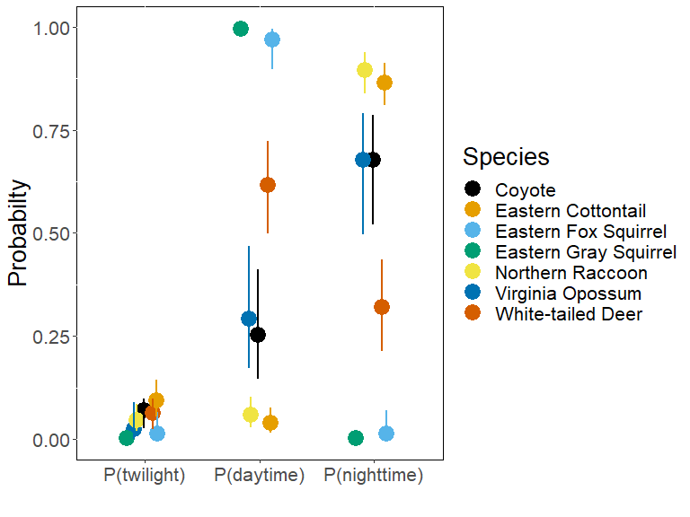

# Example 2: Multiple species with one data analysis unit

#### Author: Brian D. Gerber

#### Date: 2023-05-10

Commonly, researchers are interested in making inference on the spatial
and temporal activity of an entire meso/large mammal community. Here, we
will consider a camera trap study that is aimed at sampling multiple
animal species in an area to make inference on the diel niche of each
species. We will use data available in the package (‘diel.data’)
provided by the Urban Wildlife Information Network
(<https://www.urbanwildlifeinfo.org/>). The specific data are camera
trap detections of the urban mammal community during the winter of 2019
in Chicago, Illinois USA. The available data are aggregated independent
counts from 131 camera locations. Our objective is to evaluate the
support for the Genearl diel hypotheses and compare the diel niche
support of each species, as well as compare these results with
literature designations of diel activity.

# The Setup

``` r
# Load package
  library(Diel.Niche)
  library(lubridate)
  library(bayesplot)
  library(ggplot2)
  library(ggthemes)

# Define year variable
  diel.data$min_year = year(as.POSIXct(diel.data$min_date, format = "%m/%d/%Y"))

# Extract winter data in 2019
  winter=subset(diel.data, season=="Winter" & min_year=="2019")

# Data visual
  head(winter)
#>             scientificName twilight day night trap_nights nsite  min_date  max_date mean_lat mean_lon season       country   phylum    class           order
#> 118          Canis latrans        3   8    23         995   131 1/25/2019 2/20/2019 41.87236 -87.8423 Winter United States Chordata Mammalia       Carnivora
#> 119   Didelphis virginiana        0   7    18         995   131 1/25/2019 2/20/2019 41.87236 -87.8423 Winter United States Chordata Mammalia Didelphimorphia
#> 120 Odocoileus virginianus        4  39    20         995   131 1/25/2019 2/20/2019 41.87236 -87.8423 Winter United States Chordata Mammalia    Artiodactyla
#> 121          Procyon lotor        6   8   133         995   131 1/25/2019 2/20/2019 41.87236 -87.8423 Winter United States Chordata Mammalia       Carnivora
#> 122   Sciurus carolinensis        0 284     0         995   131 1/25/2019 2/20/2019 41.87236 -87.8423 Winter United States Chordata Mammalia        Rodentia
#> 123          Sciurus niger        0  49     0         995   131 1/25/2019 2/20/2019 41.87236 -87.8423 Winter United States Chordata Mammalia        Rodentia
#>          family             Project unit_type           Common_name Activity_Literature min_year
#> 118     Canidae UWIN_Chicago_IL_USA     28day                Coyote          Cathemeral     2019
#> 119 Didelphidae UWIN_Chicago_IL_USA     28day      Virginia Opossum           Nocturnal     2019
#> 120    Cervidae UWIN_Chicago_IL_USA     28day     White-tailed Deer         Crepuscular     2019
#> 121 Procyonidae UWIN_Chicago_IL_USA     28day      Northern Raccoon           Nocturnal     2019
#> 122   Sciuridae UWIN_Chicago_IL_USA     28day Eastern Gray Squirrel             Diurnal     2019
#> 123   Sciuridae UWIN_Chicago_IL_USA     28day  Eastern Fox Squirrel             Diurnal     2019

# Species observed
  unique(winter$scientificName)
#> [1] "Canis latrans"          "Didelphis virginiana"   "Odocoileus virginianus" "Procyon lotor"          "Sciurus carolinensis"   "Sciurus niger"         
#> [7] "Sylvilagus floridanus"
```

We can extract all the species data into object `y` as,

``` r
y = data.frame(twilight=winter$twilight,
             day=winter$day, 
             night=winter$night)
rownames(y)=winter$Common_name

y
#>                       twilight day night
#> Coyote                       3   8    23
#> Virginia Opossum             0   7    18
#> White-tailed Deer            4  39    20
#> Northern Raccoon             6   8   133
#> Eastern Gray Squirrel        0 284     0
#> Eastern Fox Squirrel         0  49     0
#> Eastern Cottontail          13   5   123
```

# Model Comparison

To get model probabilities for each species, we can define a new
function that uses the ‘diel.fit’ function and pass our data `y` to the
new function using the ‘apply’ function.

``` r
multi.fit.fun = function(y){
    out = diel.fit(t(as.matrix(y)),hyp.set=hyp.sets("General"),
                 post.fit = FALSE, prints=FALSE)

  list(ms.model=out$ms.model,prob=out$bf.table)
}

out.multi=apply(y,1,multi.fit.fun)
```

Next, we need to extract from our list the results of interest,
including the model results table for each species and the most
supported model and its probability.

``` r
# The most supported hypothesis for each species and its probability

#The probability set for each species
  temp=sapply(out.multi,function(x) x[2])
  sp.model.probs=matrix(unlist(lapply(temp, "[", , 'Posterior')),ncol=7,byrow = TRUE)
  rownames(sp.model.probs)=rownames(y)
  colnames(sp.model.probs)=rownames(temp[[1]])

  round(sp.model.probs,digits=2)
#>                       D    N CR   C2 D.CR  D.N CR.N
#> Coyote                0 0.10  0 0.20    0 0.70 0.01
#> Virginia Opossum      0 0.16  0 0.02    0 0.82 0.00
#> White-tailed Deer     0 0.00  0 0.07    0 0.93 0.00
#> Northern Raccoon      0 1.00  0 0.00    0 0.00 0.00
#> Eastern Gray Squirrel 1 0.00  0 0.00    0 0.00 0.00
#> Eastern Fox Squirrel  1 0.00  0 0.00    0 0.00 0.00
#> Eastern Cottontail    0 0.99  0 0.00    0 0.00 0.01

#The probabilities of the most supported hypothesis
  ms.hyps=unlist(lapply(out.multi,'[',1))
  ms.hyps
#>                Coyote.ms.model      Virginia Opossum.ms.model     White-tailed Deer.ms.model      Northern Raccoon.ms.model Eastern Gray Squirrel.ms.model 
#>                          "D.N"                          "D.N"                          "D.N"                            "N"                            "D" 
#>  Eastern Fox Squirrel.ms.model    Eastern Cottontail.ms.model 
#>                            "D"                            "N"

  prob.hyps=unlist(lapply(lapply(out.multi,'[',2), FUN=function(x){max(x$prob[,2])}))
  ms.hyps=data.frame(ms.hyps,prob.hyps)
```

We find that there is clear evidence (model probability at/near 1.0)
that White-tailed deer are cathemeral (Traditional), Northern Raccoon
and Eastern Cottontail are nocturnal, and the two squirrel species are
diurnal. We are less confident with model probabilities near 0.6 that
Coyote are cathemeral (Traditional) and Virginia Opossum are nocturnal.

Comparing these results to the literature (Wilson et al. 2001-2019), we
see agreement with regard to the Coyote, Virginia Opossum, Northern
Raccoon, and both squirrel species. There is however disagreement
regarding the White-tailed Deer and the Eastern cottontail, which are
considered crepuscular.

# Model Parameters

Let’s now fit each species’ most supported models to get posterior
distributions for probabilities of activity. To do so, we make a new
function that executes the ‘diel.fit’ function, but this time specifying
‘post.fit = TRUE’.

``` r

y.df=data.frame(y,hyp=ms.hyps[,1])

multi.fit.fun2 = function(y.df){
    out = diel.fit(t(as.integer(y.df[-4])),hyp.set=y.df[4],
                 post.fit = TRUE, prints=FALSE, 
                 n.chains = 3, n.mcmc = 2000, burnin = 1000)

  list(post.samp=out$post.samp[[1]], gelman.diag=out$gelm.diag)
}

out.multi2=apply(y.df,1, multi.fit.fun2)

# We can extract the geman-rubin diagnostics to check for convergence issues
  sapply(out.multi2,function(x) x[2])
#> $Coyote.gelman.diag
#> $Coyote.gelman.diag$D.N
#> Potential scale reduction factors:
#> 
#>      Point est. Upper C.I.
#> p1_1          1          1
#> p1_2          1          1
#> 
#> 
#> 
#> $`Virginia Opossum.gelman.diag`
#> $`Virginia Opossum.gelman.diag`$D.N
#> Potential scale reduction factors:
#> 
#>      Point est. Upper C.I.
#> p1_1          1       1.01
#> p1_2          1       1.01
#> 
#> 
#> 
#> $`White-tailed Deer.gelman.diag`
#> $`White-tailed Deer.gelman.diag`$D.N
#> Potential scale reduction factors:
#> 
#>      Point est. Upper C.I.
#> p1_1          1          1
#> p1_2          1          1
#> 
#> 
#> 
#> $`Northern Raccoon.gelman.diag`
#> $`Northern Raccoon.gelman.diag`$N
#> Potential scale reduction factors:
#> 
#>      Point est. Upper C.I.
#> p1_1          1       1.00
#> p1_2          1       1.01
#> 
#> 
#> 
#> $`Eastern Gray Squirrel.gelman.diag`
#> $`Eastern Gray Squirrel.gelman.diag`$D
#> Potential scale reduction factors:
#> 
#>      Point est. Upper C.I.
#> p1_1          1       1.01
#> p1_2          1       1.01
#> 
#> 
#> 
#> $`Eastern Fox Squirrel.gelman.diag`
#> $`Eastern Fox Squirrel.gelman.diag`$D
#> Potential scale reduction factors:
#> 
#>      Point est. Upper C.I.
#> p1_1       1.01       1.03
#> p1_2       1.01       1.03
#> 
#> 
#> 
#> $`Eastern Cottontail.gelman.diag`
#> $`Eastern Cottontail.gelman.diag`$N
#> Potential scale reduction factors:
#> 
#>      Point est. Upper C.I.
#> p1_1          1       1.00
#> p1_2          1       1.02
  
# Seeing no convergence issues, we can combine our chains
  post.samples=lapply(sapply(out.multi2,function(x) x[1]), FUN=function(x){do.call("rbind",x)})
  
```

``` r
# Summarize posterior model probabilities using quantiles

#all species, posterior quantiles for three parmaeters
prob.quantiles=lapply(post.samples, FUN=function(x){apply(x,2,quantile,probs=c(0.025,0.5,0.975))})

prob.quantiles$Coyote.post.samp
#>         p_crep_1   p_day_1 p_night_1
#> 2.5%  0.02591763 0.1439491 0.5256897
#> 50%   0.07040029 0.2506016 0.6798877
#> 97.5% 0.09812505 0.4005481 0.7861015

# Extract posterior medians fo each species
  prob.median=matrix(unlist(lapply(prob.quantiles, FUN = function(x){x[2,]})),ncol=3,byrow = TRUE)
  rownames(prob.median)=names(post.samples)
  colnames(prob.median)=colnames(prob.quantiles$Coyote.post.samp)
  prob.median
#>                                    p_crep_1    p_day_1   p_night_1
#> Coyote.post.samp                0.070400294 0.25060164 0.679887690
#> Virginia Opossum.post.samp      0.024499847 0.28954046 0.679735797
#> White-tailed Deer.post.samp     0.063514893 0.61401043 0.321630197
#> Northern Raccoon.post.samp      0.044757666 0.05814631 0.895781598
#> Eastern Gray Squirrel.post.samp 0.002322202 0.99426136 0.002386044
#> Eastern Fox Squirrel.post.samp  0.013880784 0.96749613 0.013536350
#> Eastern Cottontail.post.samp    0.095684179 0.03903004 0.862773497
```

# Plotting

Lets create a straightforward plot of the probabilities of activity for
each species during the three diel periods.

``` r

      post=post.samples
      n.species=length(post)
      
      post=lapply(post,FUN=function(x){colnames(x)=c("P(twilight)","P(daytime)","P(nighttime)");x})
      post=do.call('rbind',lapply(post,FUN=function(x){mcmc_intervals_data(x, prob = 0.5, prob_outer = 0.95)}))
      post$Species <- rep(rownames(y), each = 3)
      y.pos=rep(rnorm(nrow(post)/3,0,0.07),each=3)
      pos <- position_nudge(y = y.pos, x=rep(0,nrow(post)))
      p=ggplot(post, aes(x = m, y = parameter, color = Species)) + 
        geom_point(size=6,position=pos) +
        geom_linerange(aes(xmin = ll, xmax = hh),size=1,position=pos)+
        xlab("Probabilty")+ylab("")+xlim(0,1)+
        theme(text = element_text(size = 20))+ coord_flip()+
         scale_colour_colorblind()+
        #geom_hline(yintercept=c(0.7,1.3,1.7,2.3,2.7,3.3),color="black",size=1.2)+ 
                theme(panel.background = element_rect(fill='white', colour='black'), legend.key=element_rect(fill="white"))
      
      p      
```

<!-- -->

``` r

#ggsave(p, file="Example2.plot.png",width=8, height=6, dpi=300)
```

We see that the the two species most active during twilight are the
Eastern Cottontail and the Coyote. The Fox and Gray Squirrels are almost
only active during the daytime, thus confirming why they were classifed
as diurnal. The white-tailed deer is most active during the day but
stilll about a 0.27 probability of being active at nighttime. The
Eastern Cottontail, Virginia Opossum, and the Northern Raccoon are
highly active during the nighttime with probabilities greater than 0.80.

# References

Wilson, D.E. Rylands, A.B., Lacher, T.E., Mittermeier, R.A. (2001-2019)
Handbook of the mammals of the world - Volume 1-3, 5-9, (Lynx Edicions,
Barcelona)
