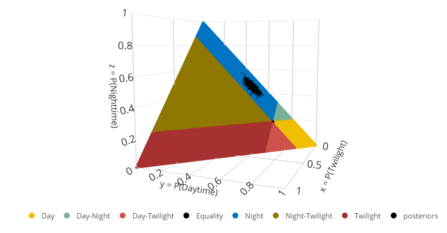
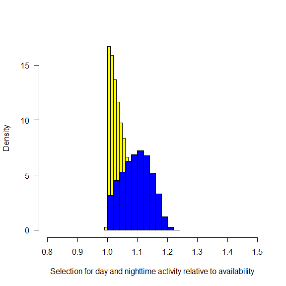

# Diel Selection

#### Author: Mason Fidino, Aka Dr. Rockstar

#### Date: 2023-06-15

We will consider the hypothesis set, *Selection*, to make inference on
diel periods that are used more than the amount of time available.

# The Setup

``` r
# Load packages
  library(Diel.Niche)
  library(lubridate)
#> 
#> Attaching package: 'lubridate'
#> The following objects are masked from 'package:base':
#> 
#>     date, intersect, setdiff, union
  library(suncalc)
```

We will use data available in the package (`diel.data`) provided by the
Urban Wildlife Information Network
(<https://www.urbanwildlifeinfo.org/>), coordinated by the Lincoln Park
Zoo’s Urban Wildlife Institute . The specific data are camera trap
detections of the white-tailed deer (*Odocoileus virginianu*) collected
in Chicago, Illinois during 2020. Since there are 5 different data sets
from 2020, we are only going to grab one dataset from the summer and
another from the fall.

``` r
data(diel.data)

# Define a year variable
  diel.data$min_year  <-lubridate::year(
    lubridate::mdy(
      diel.data$min_date
    )
  )

# Extract data
  deer <- subset(
    diel.data,
    scientificName == "Odocoileus virginianus" &
    min_year == "2020"
  )


# subset to first two
  deer <- deer[deer$min_date %in% c("7/5/2020", "10/2/2020"),]

# Visualize the data
  head(deer)
#>             scientificName twilight day night trap_nights nsite  min_date   max_date mean_lat mean_lon season       country   phylum    class        order
#> 193 Odocoileus virginianus       33 241   232        2211   131  7/5/2020  7/29/2020 41.87236 -87.8423 Summer United States Chordata Mammalia Artiodactyla
#> 211 Odocoileus virginianus        3  46    47         903   131 10/2/2020 10/29/2020 41.87236 -87.8423 Autumn United States Chordata Mammalia Artiodactyla
#>       family             Project unit_type       Common_name Activity_Literature min_year
#> 193 Cervidae UWIN_Chicago_IL_USA     28day White-tailed Deer         Crepuscular     2020
#> 211 Cervidae UWIN_Chicago_IL_USA     28day White-tailed Deer         Crepuscular     2020
```

One small complication that makes the selection hypothesis set different
from the other hypothesis sets is that it requires you to input the
proportion of time each diel period takes up during a given time of
year. This can be done using the `suncalc` package in `R` via
`getSunlightTimes()`. This function allows a vector of dates but only a
single latitude and longitude. Fortuantely, `diel.data` already has the
average location of Chicago, Illinois. For you own work, you could
likely just take the average of all your camera traps in a given study
area.

``` r
  chicago.hours <- suncalc::getSunlightTimes(
    date = lubridate::mdy(deer$min_date),
    lat = unique(deer$mean_lat),
    lon =  unique(deer$mean_lon),
    keep = c("dusk", "night", "dawn","nightEnd"),
    tz = "US/Central"
  )

# calculate the hours in each diel period
twilight.hours <- (chicago.hours$dawn - chicago.hours$nightEnd) +
  (chicago.hours$night - chicago.hours$dusk)
day.hours <- chicago.hours$dusk - chicago.hours$dawn
night.hours <- 24 - (twilight.hours + day.hours)

# Add some new columns to diel.data, but also make these hours
#  into proportions.
deer$prop_twilight <- as.numeric(twilight.hours / 24)
deer$prop_day <-  as.numeric(day.hours / 24)
deer$prop_night <- as.numeric(night.hours / 24)
```

Now that we have added all of these proportions, we just need call
`diel.fit()` to estimate selection. However, in order to do this we need
to modify the inequalities used to fit this model with `diel.ineq()`.
And while we calculated all three proportions (twilight, day, and
night), we only need to provide the first two to `diel.ineq()`. As there
are two datasets from 2021, let’s fit each individually and inspect the
results. But since we have data from different parts of the year, let’s
also plot out the visual representation of this diel hypothesis set to
see how they differ.

For this first dataset, the `triplot` looks like

``` r

# first dataset
  selection.ineq1 <- diel.ineq(
    p.avail =  c(
      deer$prop_twilight[1],
      deer$prop_day[1]
    )
  )

  triplot(
    hyp = hyp.sets("Selection"),
    diel.setup = selection.ineq1
  )
```

<!-- -->

and the second `triplot`, which has less `Night-Twilight` but more
`Twilight` is:

``` r
  selection.ineq2 <- diel.ineq(
    p.avail =  c(
      deer$prop_twilight[2],
      deer$prop_day[2]
    )
  )

  triplot(
    hyp = hyp.sets("Selection"),
    diel.setup = selection.ineq2
  )
```

<!-- -->

And now, to the analysis. For the first dataset we could use the already
created `selection.ineq1` {

``` r

# subset data to response variables
  deer.y1 <- as.matrix(
    deer[1,c("twilight", "day", "night")]
  )

  out1 <- diel.fit(
    deer.y1,
    hyp.set = hyp.sets("Selection"),
    diel.setup = selection.ineq1,
    n.chains = 2,
    post.fit = TRUE
  )
#> Data checks Complete.
#> Calculating Bayes Factors...
#> Posterior Sampling...
#> The most supported model is: 
#>  Night (Selection)
  
  out1$bf.table
#>                Prior Posterior
#> D.avail    0.1428571         0
#> TW.avail   0.1428571         0
#> N.avail    0.1428571         1
#> EQ.avail   0.1428571         0
#> D.TW.avail 0.1428571         0
#> N.TW.avail 0.1428571         0
#> D.N.avail  0.1428571         0
```

The most supported model for this dataset (`N.avail`) indicated that
white-tailed deer are using the night diel period far more than it is
available. Looking at the raw data (i.e., `deer.y1`), about 45% of the
camera images collected occurred at night. However, night only accounted
for 19% of the diel time during a day.

``` r

round(
  deer.y1 / sum(deer.y1),
  2
)
#>     twilight  day night
#> 193     0.07 0.48  0.46

round(
  deer[1,c("prop_twilight", "prop_day", "prop_night")],
  2
)
#>     prop_twilight prop_day prop_night
#> 193          0.13     0.68       0.19
```

If we wanted to look at a histogram that quantifies the selection for a
given diel period, we can do so by taking the MCMC output of the best
fit model and dividing that respective category by the proportion of
time it was available. When a species is selecting for a diel period
more than it is available, then the posterior distribution should be
above 1, which in this case it clearly is.

``` r

hist(
  out1$post.samp.ms.model[,"p_night_1"] / deer$prop_night[1],
  main = "",
  xlim = c(0,3),
  las = 1,
  xlab = "Selection for nighttime activity relative to availability"
)
abline(v = 1, lty = 2)
```

<!-- -->

And finally, we can plot the posterior out ontop of the full parameter
space for the Selection hypothesis set with `triplot()`.

``` r

triplot(
  out1,
  diel.setup = selection.ineq1
)
```

<!-- -->

And here is the same analysis, but with the second dataset from the
fall, where we find slightly different results!

``` r

# subset data to response variables
  deer.y2 <- as.matrix(
    deer[2,c("twilight", "day", "night")]
  )

  out2 <- diel.fit(
    deer.y2,
    hyp.set = hyp.sets("Selection"),
    diel.setup = selection.ineq2,
    n.chains = 2,
    post.fit = TRUE
  )
#> Data checks Complete.
#> Calculating Bayes Factors...
#> Posterior Sampling...
#> The most supported model is: 
#>  Day-Night (Selection)
  
  round(
    out2$bf.table,
    2
  )
#>            Prior Posterior
#> D.avail     0.14      0.01
#> TW.avail    0.14      0.00
#> N.avail     0.14      0.24
#> EQ.avail    0.14      0.04
#> D.TW.avail  0.14      0.00
#> N.TW.avail  0.14      0.00
#> D.N.avail   0.14      0.71
```

For this analysis, Day-Night Selection (`D.N.avail`) was the most
supported hypothesis, though support for it was much weaker with a Bayes
factor of 0.71. For this dataset, it appears that deer spent most of
their time active during either the day or night, which together
represented about 91% of a given day.

``` r

round(
  deer.y2 / sum(deer.y2),
  2
)
#>     twilight  day night
#> 211     0.03 0.48  0.49

round(
  deer[2,c("prop_twilight", "prop_day", "prop_night")],
  2
)
#>     prop_twilight prop_day prop_night
#> 211          0.09     0.53       0.38
```

Plotting out selection for these two diel periods is a bit trickier, but
it could be done in two ways. First, you could sum the two MCMC chains
together or you could look at selection for each one on their own.

``` r

hist(
  rowSums(
    out1$post.samp.ms.model[,c("p_day_1", "p_night_1")]
  )/ (deer$prop_day[2] + deer$prop_night[2]),
  main = "",
  las = 1,
  xlab = "Selection for day or nighttime activity relative to availability"
)
abline(v = 1, lty = 2)
```

<!-- -->

In this case, there does appear to be some amount of selection in that
most of the posterior is above 1. However, the selection for these two
time periods is incredibly small for this specific dataset (i.e., this
may be ‘biologically significant’). Plotting this out on via `triplot()`
you can see that the entire `Day-Night (Selection)` parameter space is
filled with the posterior.

``` r

triplot(
  out2,
  diel.setup = selection.ineq2
)
```

<!-- -->

# Conclusion

The Selection hypothesis set is unlike all the other flavors of
hypotheses within `Diel.Niche` because it can be used to quantify use
relative to availability in a way that is similar to resource selection
functions. This additional nuance allows users of `Diel.Niche` to not
only classify the diel phenotype of a given species, but also to
determine if there are specific diel periods that are used more than
they are available. This could be of particular interest for species
that are classified as Crepuscular, given that this diel period is
relatively small. While White-tailed deer are considered crepuscular,
our analysis showed that they actually used night much more than other
diel periods, which may be the result of deer modifying their activity
levels throughout urban Chicago. Conversely, deer may be selecting for
night during the summer given how hot it can get throughout Chicago as a
way to better regulate their body temperature.
