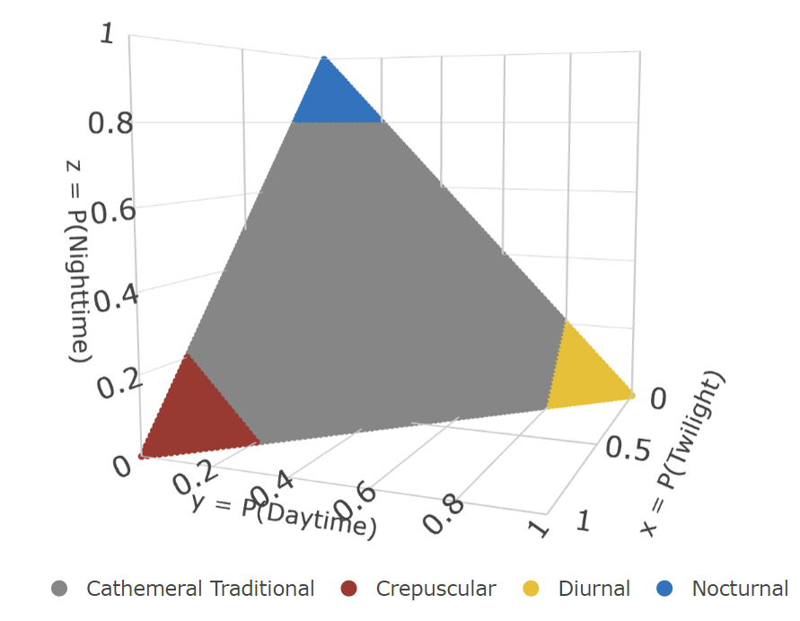

``` r
# Load Libraries and Data
  library(ggplot2)
  library(Diel.Niche)
  haysom <- readRDS("../vignettes/HaysomData.rda")
```

Gomez et al. 2005 offered a set of criteria to define six diel
phenotypes. These definitions were used by Haysom et al. 2023 and well
described in their Table 1. Our goal is to implement the Gomez
phenotypes within the $\texttt{Diel.Niche}$ package and apply it to data
from Haysom et al. 2023 (Supplementary material, Table S2; the modified
csv file located at /inst/extdata/haysom.data.supp.table.modified.csv
and stored in /vignettes/HaysomData.rda”). We can then compare results
between the hypothesis sets from the $\texttt{Diel.Niche}$ package
(i.e., Traditional and General) with that of the Gomez hypothesis set.
To review the hypothesis sets from the $\texttt{Diel.Niche}$ please see
the [Main package
vignette](https://github.com/diel-project/Diel-Niche-Modeling/blob/main/GitHub_vignettes/Diel-Niche-vignette.md).

*Objectives*

- Demonstrate how to implement phenotypes from other sources in the
  $\texttt{Diel.Niche}$ package
- Demonstrate how to visualize and use a new hypothesis set
- Compare phenotype results across hypothesis sets from Haysom et
  al. 2023.

Note that $p_{tw}$, $p_d$, and $p_n$ are the probabilities of activity
during the twilight, daytime, and nighttime.

## Gomez Diel Niche

Gomez et al. 2005 define six diel phenotypes. Using the Table 1
descriptions of Haysom et al. 2023 these are defined as:

- Strictly Nocturnal: $p_n \geq 0.90$
- Mostly Nocturnal: $p_n \geq 0.70$ and $p_n < 0.90$
- Strictly Diurnal: $p_d \geq 0.90$
- Mostly Nocturnal: $p_d \geq 0.70$ and $p_d < 0.90$
- Crepuscular: $p_{tw} \geq 0.50$
- Cathemeral: $p_n \geq 0.10$, $p_n < 0.70$, $p_d \geq 0.10$,
  $p_d < 0.70$

The one difference between Gomez et al. 2005 and Haysom et al. 2023 is
that Haysom et al. 2023 defined the Cathemeral phenotype with
constraints (above), while Gomez et al. 2005 defined it as all
combinations that were not nocturnal, diurnal, or crepuscular. We will
use the Haysom et al. 2023 definition of Cathemeral.

## Gomez Phenotype Translation using Multinomial Inequalities

First, we need to translate the phenotype thresholds into multinomial
inequalities.

### Example 1

Lets describe how to translate the Crepuscular hypothesis into the
$\texttt{Diel.Niche}$ setup.

$$
\begin{equation} 
\begin{split}
& p_{\text{tw}} \geq 0.5 \\
\end{split}
\end{equation}
$$

Next, we need to translate the inequality into the framework of
$\mathbf{A} \boldsymbol{\theta} \leq \mathbf{b}$.

$$
\begin{equation} 
\begin{aligned}
 p_{\text{tw}} & \geq 0.50 \\
 -p_{\text{tw}} & \leq -0.50 \\
 (-1) \times p_{\text{tw}} + (0)\times p_{\text{d}} & \leq -0.50 \\
\end{aligned}
\end{equation}
$$ Putting it together, we take the constants in parentheses left of the
equal sign and package it into matrix $\mathbf{A}$ and take the
constants on the right of the equal sign and package it into vector
$\mathbf{b}$ as,

$$
\begin{equation} 
\textbf{A} = \begin{bmatrix}
-1 & 0 \\
\end{bmatrix}, \textbf{b} = \begin{bmatrix} -0.50 \\ \end{bmatrix}.
\end{equation}
$$

### Example 2

For a second example, lets describe how to translate the Mostly Diurnal
hypothesis into the $\texttt{Diel.Niche}$ setup. The two inequalities
are,

$$
\begin{equation} 
\begin{split}
& p_{\text{d}} \geq 0.7 \\
& p_{\text{d}} < 0.9 \\
\end{split}
\end{equation}
$$

Starting with the first inequality, we need to translate the inequality
into the framework of $\mathbf{A} \boldsymbol{\theta} \leq \mathbf{b}$.

$$
\begin{equation} 
\begin{split}
 p_{\text{d}} &\geq 0.70 \\
 -p_{\text{d}} &\leq -0.70 \\
 (0) \times p_{\text{tw}} + (-1)\times p_{\text{d}} &\leq -0.70 \\
\end{split}
\end{equation}
$$

Now let’s take the second inequality where $\epsilon$ is a very small
number (0.0001) so that we can change the less than operation to the
less than or equal operation, which is required in this framework.

$$
\begin{equation} 
\begin{split}
 p_{\text{d}} & < 0.90 \\
 p_{\text{d}} &\leq 0.90 - \epsilon \\
 -p_{\text{d}} &\leq 0.90 \\
 (0) \times p_{\text{tw}} + (1)\times p_{\text{d}} &\leq 0.90 - \epsilon \\
\end{split}
\end{equation}
$$ Putting it together, we take the constants in parentheses left of the
equal sign and package it into matrix $\mathbf{A}$ and take the
constants on the right of the equal sign and package it into vector
$\mathbf{b}$ as,

$$
\begin{equation} 
\textbf{A} = \begin{bmatrix}
0 & -1 \\
0 & 1
\end{bmatrix}, \textbf{b} = \begin{bmatrix} -0.70 & 0.90 - \epsilon \\ \end{bmatrix}.
\end{equation}
$$

In the next section, we show how to put these inequality values into
$\texttt{Diel.Niche}$, along with all other phenotype hypotheses.

## Gomez Implementation in Diel.Niche

``` r
# Use the diel.ineq() function to setup an object to add multinomial inequalities too.
  diel.setup=diel.ineq()

# Crepuscular
# p_tw >= 0.5
  A <- matrix(
    c(-1,0),
    ncol = 2,
    byrow = TRUE
  )
  b <- -0.50
  G.crep <- list(
    Name="Gomez Crepuscular",
    A=A,
    b=b,
    func="bf_multinom"
  )  
  diel.setup$G.crep <- G.crep


# Strict Nocturnal
# p_n >= 0.90
  A <- matrix(
    c(1,1),
    ncol = 2,
    byrow = TRUE
  )
  b <- 0.1
  G.strict.N <- list(
    Name="Gomez Strict Nocturnal",
    A=A,
    b=b,
    func="bf_multinom"
  )  
  diel.setup$G.strict.N <- G.strict.N
  
# Mostly Nocturnal
# p_n >= 0.70
# p_n < 0.90

  A <- matrix(
    c(1,1,-1,-1),
    ncol = 2,
    byrow = TRUE)

  b <- c(0.3,0.8999-1)
  G.mostly.N <- list(
    Name="Gomez Mostly Nocturnal",
    A=A,
    b=b,
    func="bf_multinom"
  )  
  diel.setup$G.mostly.N <- G.mostly.N

# Strict Diurnal
# p_n >= 0.90
  A <- matrix(
    c(0,-1),
    ncol = 2,
    byrow = TRUE
  )
  b <- -0.90
  G.strict.D <- list(
    Name="Gomez Strict Diurnal",
    A=A,
    b=b,
    func="bf_multinom"
  )  
  diel.setup$G.strict.D <- G.strict.D
  
# Mostly Diurnal
# p_n >= 0.70
# p_n < 0.90

  A <- matrix(
    c(0,-1,0,1),
    ncol = 2,
    byrow = TRUE
  )
  b <- c(-0.7,0.8999)
  G.mostly.D <- list(
    Name="Gomez Mostly Diurnal",
    A=A,
    b=b,
    func="bf_multinom"
  )  
  diel.setup$G.mostly.D <- G.mostly.D

# Cathemeral
# p_d > 0.1
# p_d < 0.7
# p_n > 0.1
# p_n < 0.7
  A <- matrix(
    c(0,-1,0,1,1,1,-1,-1),
    ncol = 2,
    byrow = TRUE
  )
  b <- c(-0.099999, 0.699999,-0.099999+1,0.699999-1)
  G.cath <- list(
    Name="Gomez Cathemeral",
    A=A,
    b=b,
    func="bf_multinom"
  )  
  diel.setup$G.cath <- G.cath
```

``` r
# Plot the full hypothesis set
  triplot(
    hyp=c(
      "G.crep","G.cath",
      "G.strict.N","G.mostly.N",
       "G.strict.D", "G.mostly.D"
    ),
    diel.setup = diel.setup
  )
```

<!-- -->

Visualizing phenotype constraints is really helpful to understand the
full set of hypotheses and how they complement each other. In the plot,
we can see how the strictly and mostly diurnal and nocturnal hypotheses
are defined equivalently, while the crepuscular hypothesis set has a
much looser definition and thus a larger parameter space. Presumably,
this is to account for the smaller amount of available time during the
twilight period. Another important thing to notice is that the
crepuscular and cathemeral definitions are not mutually exclusive
parameter spaces, which makes differentiating between them difficult
(you may not be able to see this in the figure above, but you can turn
each hypothesis off by clicking on it’s associated label at the bottom
of the figure; does not work in the .md file on Github, only in the .Rmd
file). Lastly, we can see two areas of empty parameter space that are
left undefined.

# Modifications to Gomez et al. 2005

We could consider a modified set of hypotheses with a few changes to the
crepuscular and cathemeral hypotheses. First, we could make the
equivalent crepuscular hypotheses of strictly and mostly with the same
constraints. This would make it a fair comparison between crepuscular
and diurnal and crepuscular and nocturnal. Second, we could modify the
cathemeral hypothesis to fill out the rest of the parameter space so
there are no overlapping or missing parameter spaces that are left
undefined.

``` r
# Alternative Cathemeral 
  A.C <- matrix(
    c(0,1,1,0,-1,-1),
    ncol = 2,
    byrow = TRUE
  )
  b.C <- c(0.70-0.0001,0.70-0.001,0.70-0.001-1)
  Gomez.alt.C <- list(
    Name="Cathemeral Traditional",
    A=A.C,b=b.C,func="bf_multinom"
  )  
  diel.setup$Gomez.alt.C <- Gomez.alt.C

# Crepuscular Strict
# p_tw >=0.9
  A <- matrix(
    c(-1,0),
    ncol = 2,
    byrow = TRUE
  )
  b <- -0.90
  G.strict.CR <- list(
    Name="Gomez Strict Crepuscular",
    A=A,
    b=b,
    func="bf_multinom"
  )  
  diel.setup$G.strict.CR <- G.strict.CR

# Mostly Crepuscular
  # p_tw >=0.9
  A <- matrix(
    c(-1,0,1,0),
    ncol = 2, 
    byrow = TRUE
  )
  b <- c(-0.70,0.89999)
  G.mostly.CR <- list(
    Name="Gomez Mostly Crepuscular",
    A=A,
    b=b,
    func="bf_multinom"
  )  
  diel.setup$G.mostly.CR <- G.mostly.CR
  

    triplot(
      hyp=c(
        "G.mostly.CR","G.strict.CR","Gomez.alt.C",
        "G.strict.N","G.mostly.N",
        "G.strict.D", "G.mostly.D"
      ),
      diel.setup = diel.setup,
      more.points = FALSE
    )
```

<!-- -->
This modified hypothesis set is now similar to the Traditional
hypothesis set of the $\texttt{Diel.Niche}$ package, but more
specificity in ‘strictly’ and ‘mostly’ singular phenotypes. The
threshold is a little bit smaller, 0.70 or more to be called
diurnal/nocturnal/crepuscular, while in the Traditional hypothesis set
this threshold probability is pre-set at 0.80.

``` r
triplot(hyp=hyp.sets("Traditional"))
```

<!-- -->
# Haysom et al. 2023 Results Comparison (Gomez)

Lets see if our hypothesis set results in agreement with that of the
primary activity identified by Haysom et al. 2023.

``` r
# Extract Haysom et al. 2023 data
  y <- cbind(
    haysom$twilight,
    haysom$daylight, 
    haysom$darkness
  )

  haysom$sample.size  <- haysom$twilight+haysom$daylight+haysom$darkness
    
# Note that in Haysom et al. 2023 supplementary table S2 the Muntiacus  
# atherodes (Bornean  yellow  muntjac) for the unlogged dataset was defined 
# with a Primary activity pattern as 'Diurnal'. This is not the same labels as
# other hypotheses; we interpreted this to mean 'mostly diurnal' and have 
#  changed this result in our modified csv file for Table S2. 
  
# Model Fitting Function
  multi.fit.fun <- function(y,hyp.set){
    out = diel.fit(
      t(
        as.matrix(y)
      ),
      hyp.set = hyp.set,
      diel.setup = diel.setup,
      post.fit = FALSE, 
      prints=FALSE,
      n.mcmc = 5000,
      burnin  = 1000
    )
# Get the Bayes factors for each hypothesis 
    list(
      ms.model = out$ms.model,
      prob = out$bf.table
    )
  }

# Apply the function to the data, y
  multi.fit.gomez <- apply(
    y,
    1,
    multi.fit.fun,
    hyp.set = c("G.crep","G.cath",
                "G.strict.N","G.mostly.N",
                "G.strict.D", "G.mostly.D")
  )

# Get the most supported hypotheses codes
  ms.hyps.gomez <- unlist(
    lapply(
      multi.fit.gomez,'[',1)
  )
  
  data.frame(
    ms.hyps.gomez,
    haysom$Primary.Activity, 
    haysom$sample.size
  )
```

    ##    ms.hyps.gomez haysom.Primary.Activity haysom.sample.size
    ## 1         G.cath              cathemeral                 21
    ## 2         G.cath              cathemeral                 23
    ## 3         G.cath              cathemeral                 11
    ## 4         G.cath              cathemeral                 12
    ## 5     G.mostly.D          mostly diurnal                 30
    ## 6     G.mostly.D          mostly diurnal                 23
    ## 7         G.cath          mostly diurnal                  7
    ## 8         G.crep             crepuscular                 28
    ## 9         G.crep             crepuscular                 18
    ## 10        G.crep             crepuscular                 10
    ## 11        G.crep          mostly diurnal                 15
    ## 12        G.crep             crepuscular                 13
    ## 13        G.cath              cathemeral                 24
    ## 14        G.cath              cathemeral                 17
    ## 15        G.cath              cathemeral                  7
    ## 16    G.mostly.D              cathemeral                 19
    ## 17    G.mostly.N        mostly nocturnal                  5
    ## 18    G.mostly.N        mostly nocturnal                 80
    ## 19    G.strict.N      strictly nocturnal                 34
    ## 20    G.mostly.N        mostly nocturnal                 46
    ## 21    G.mostly.N        mostly nocturnal                159
    ## 22    G.mostly.N        mostly nocturnal                121
    ## 23    G.strict.N      strictly nocturnal                 38
    ## 24    G.mostly.N        mostly nocturnal                 11
    ## 25    G.mostly.N        mostly nocturnal                276
    ## 26    G.mostly.N        mostly nocturnal                144
    ## 27    G.mostly.N        mostly nocturnal                132
    ## 28        G.cath              cathemeral                 93
    ## 29        G.cath             crepuscular                 46
    ## 30        G.cath              cathemeral                 47
    ## 31        G.cath              cathemeral                608
    ## 32        G.cath          mostly diurnal                224
    ## 33        G.cath          mostly diurnal                384
    ## 34        G.crep             crepuscular                305
    ## 35        G.crep             crepuscular                103
    ## 36        G.crep             crepuscular                202
    ## 37        G.cath        mostly nocturnal                832
    ## 38        G.cath        mostly nocturnal                552
    ## 39    G.mostly.N        mostly nocturnal                267
    ## 40        G.cath              cathemeral                911
    ## 41    G.mostly.D          mostly diurnal                449
    ## 42        G.cath              cathemeral                462
    ## 43        G.cath              cathemeral                720
    ## 44        G.cath              cathemeral                514
    ## 45        G.cath              cathemeral                206
    ## 46        G.cath              cathemeral                122
    ## 47        G.cath              cathemeral                 41
    ## 48        G.cath              cathemeral                 81
    ## 49    G.strict.N      strictly nocturnal                 28
    ## 50    G.strict.N      strictly nocturnal                 10
    ## 51        G.crep             crepuscular                 80
    ## 52        G.crep             crepuscular                 71
    ## 53        G.crep             crepuscular                  9
    ## 54        G.crep             crepuscular                 40
    ## 55    G.mostly.D          mostly diurnal                 68
    ## 56        G.crep          mostly diurnal                 63
    ## 57    G.strict.D        strictly diurnal                  5
    ## 58    G.mostly.D          mostly diurnal                507
    ## 59    G.mostly.D          mostly diurnal                326
    ## 60    G.mostly.D          mostly diurnal                181
    ## 61        G.crep             crepuscular                 64
    ## 62    G.mostly.D          mostly diurnal                443
    ## 63        G.crep          mostly diurnal                 56
    ## 64        G.crep          mostly diurnal                 43
    ## 65    G.mostly.D          mostly diurnal                 13
    ## 66    G.mostly.D          mostly diurnal                 46
    ## 67    G.mostly.D          mostly diurnal                 28
    ## 68    G.mostly.D          mostly diurnal                 18
    ## 69    G.mostly.N        mostly nocturnal                 17
    ## 70    G.mostly.N        mostly nocturnal                 10
    ## 71    G.mostly.N        mostly nocturnal                  7
    ## 72    G.strict.N        mostly nocturnal                 59
    ## 73    G.mostly.D          mostly diurnal                 13
    ## 74    G.mostly.D          mostly diurnal                326
    ## 75    G.mostly.D          mostly diurnal                154
    ## 76    G.mostly.D          mostly diurnal                172
    ## 77    G.mostly.N        mostly nocturnal                 37
    ## 78    G.strict.D        strictly diurnal                100
    ## 79    G.strict.D        strictly diurnal                 68
    ## 80    G.strict.D          mostly diurnal                 32
    ## 81    G.mostly.D          mostly diurnal                 53
    ## 82    G.mostly.D          mostly diurnal                 44
    ## 83    G.strict.D        strictly diurnal                  9
    ## 84        G.crep             crepuscular                 14
    ## 85        G.crep             crepuscular                  5
    ## 86        G.crep             crepuscular                  9
    ## 87        G.crep             crepuscular                  8
    ## 88    G.mostly.D          mostly diurnal                  6
    ## 89    G.mostly.N        mostly nocturnal                 13
    ## 90    G.strict.N      strictly nocturnal                 34
    ## 91    G.strict.N      strictly nocturnal                115
    ## 92    G.strict.N        mostly nocturnal                 66
    ## 93    G.strict.N      strictly nocturnal                 49
    ## 94    G.strict.N        mostly nocturnal                129
    ## 95    G.strict.N      strictly nocturnal                117
    ## 96    G.mostly.N        mostly nocturnal                 12
    ## 97    G.mostly.N        mostly nocturnal                 49
    ## 98    G.mostly.N        mostly nocturnal                 41
    ## 99    G.strict.N      strictly nocturnal                  8

There seems to be some differences with respect to some of the ‘mostly’
phenotype classifications.

| Row number | Diel.Niche classification | Haysom et al. classification | Sample size |
|------------|---------------------------|------------------------------|-------------|
| 7          | G.cath                    | mostly diurnal               | 7           |
| 11         | G.crep                    | mostly diurnal               | 15          |
| 16         | G.mostly.D                | cathemeral                   | 19          |
| 32         | G.cath                    | mostly diurnal               | 224         |
| 33         | G.cath                    | mostly diurnal               | 384         |
| 37         | G.cath                    | mostly nocturnal             | 832         |
| 38         | G.cath                    | mostly nocturnal             | 552         |
| 56         | G.crep                    | mostly diurnal               | 63          |
| 64         | G.crep                    | mostly diurnal               | 43          |
| 72         | G.strict.N                | mostly nocturnal             | 59          |
| 92         | G.strict.N                | mostly nocturnal             | 66          |
| 94         | G.strict.N                | mostly nocturnal             | 129         |

Out of 99 comparisons, there appears to be 12 (12%) differences between
the results of Haysom et al. 2023 and our implementation of the Gomez et
al. 2005 hypotheses. These appear to be largely due to small sample size
leading to higher model uncertainty between models in a set. In a few
cases (e.g., 37 and 38), it looks like the threshold to meet the ‘mostly
nocturnal’ phenotype for Greater mousedeer in unlogged and logged may
not have been actually been met (53% and 61%, respectively), and may be
more appropriately Cathemeral. However, most detections outside of
nighttime were during twilight which is not considered as part of
Cathemeral under the definitions from Haysom et al. 2023 (Table 1).

# Haysom et al. 2023 Results Comparison (Traditional)

Let’s now use the Gomez hypothesis set (unmodified) and compare it to
the Traditional hypothesis set with the data from Haysom et al. 2023.

``` r
# Apply the function to the data, y
  out.multi.trad <- apply(
    y,
    1,
    multi.fit.fun, 
    hyp.set=hyp.sets("Traditional")
  )

#Get the most supported hypotheses codes
  ms.hyps.trad <- unlist(
    lapply(
      out.multi.trad,'[',1)
  )
```

Let’s plot these results along with those from the Primary Activity from
Haysom et al. 2023 to see how they line up. Meaning, we want to see how
the different datasets are called one hypothesis in their results with
what they would be called using the Traditional hypothesis sets.

``` r
dat.comp <- data.frame(
  haysom$Primary.Activity,
  ms.hyps.trad
)

ggplot(
  as.data.frame(table(dat.comp)),
  aes(x=haysom.Primary.Activity, y = Freq, fill=ms.hyps.trad)) + 
  geom_bar(stat="identity")
```

<!-- -->

In this plot, the Gomez hypotheses are on the x-axis and the frequency
they are defined by hypotheses from the Traditional hypothesis set
(legend) is on the y-axis. We see that the strictly nocturnal and
cathemeral results (x-axis) correspond the same to Traditional
Cathemeral and Traditional Nocturnal. The biggest difference is in what
the Gomez hypotheses called ‘mostly diurnal’ or mostly ‘nocturnal’, the
Traditional hypothesis set defined as Traditional Cathemeral. Why is
that? That is because to be Traditional Cathemeral only two diel periods
need to be used more than a probability of 0.10. This occurs under the
‘mostly’ phenotype definitions when the probability threshold for the
dominant activity to be between 0.70 and 0.90, which means between 0.3
and 0.10 probability could be within one or two of the other diel
periods and thus more than the 0.10 probability threshold. Another
notable difference is that because the Gomez hypotheses have an unequal
definition of Crepuscular with overlapping probability space with
Cathemeral, most species and data analysis units defined as crepuscular
are defined as Traditional Cathemeral in the Traditional hypothesis set.

# Haysom et al. 2023 Results Comparison (General)

Haysom et al. 2023 took an interesting approach to expand on the primary
activity patterns identified by the Gomez hypotheses by,

“Once primary activity patterns had been defined, we assessed the
significance of the deviation from expected proportions using a binomial
test (following Van Schaik & Griffiths, 1996). Any secondary patterns
were noted where, after the primary pattern had been determined, the
proportion of remaining detections showed a clear tendency toward
activity during another period. For example, a species with the majority
of detections during twilight and the remainder during daylight would be
categorized as “crepuscular with diurnal tendencies.”

The combination of the primary and secondary activity patterns are akin
to the goal of the General hypothesis set. We can compare findings by
concatenating findings of the primary and secondary results and fitting
the General hypothesis set to the data.

``` r
# Apply the function to the data, y
  out.multi.gen <- apply(
    y,
    1,
    multi.fit.fun, 
    hyp.set=hyp.sets("Traditional")
  )

# Extract the most supported hypotheses
  ms.hyps.gen <- unlist(
    lapply(
      out.multi.gen,'[',1)
  )
```

Now, lets plot to compare the Primary-secondary results with that of the
results you would get using the General hypothesis set.

``` r
haysom.combined <- paste(
  haysom$Primary.Activity,
  haysom$Secondary.Activity.Simple
)

dat.comp2 <- data.frame(
  haysom.combined,
  ms.hyps.gen
)

ggplot(
  as.data.frame(table(dat.comp2)),
  aes(x=haysom.combined, y = Freq, fill=ms.hyps.gen)) + 
  geom_bar(stat="identity")+ 
  theme(axis.text.x = element_text(angle = 90, vjust = 0.5, hjust=1))
```

<!-- -->

In this plot, the Gomez hypotheses defining the primary activity and the
secondary activity are combined as hypotheses on the x-axis and the
frequency they are defined by hypotheses from the Traditional hypothesis
set (legend) is on the y-axis. The General hypothesis set does not have
a binomial hypothesis of cathemeral and another activity period as are
on the x-axis, so those aren’t directly comparable. We see there is
strong agreement of crepuscular diurnal and mostly diurnal crepuscular
with that of the Diurnal-Crepsucular hypothesis. There is also strong
agreement with the mostly nocturnal crepuscular combination with that of
the Crepuscular-Nocturnal hypothesis. There are also disagreements with
many combinations because of the different thresholds used.

# Conclusion

We implemented the Gomez et al. 2005 phenotypes to be provide another
hypothesis set for researchers to consider. The walk through hopefully
helped demonstrate how to implement a set of hypotheses and how to
visualize hypotheses to match one’s expectation. We found some important
differences in how the Traditional hypothesis set defined Cathemeral
compared to Gomez’s ‘mostly’ diurnal and nocturnal. There were more
difference when comparing the primary and secondary activity pattern
results from Haysom et al. 2023 with the General hypothesis set.

# References

Gomez, H., Wallace, R. B., Ayala, G., & Tejada, R. (2005). Dry season
activity periods of some Amazonian mammals. Studies on Neotropical Fauna
and Environment, 40(2), 91–95.
<https://doi.org/10.1080/01650520500129638>

Haysom, J. K., Deere, N. J., Mahyudin, A., & Struebig, M. J. (2023).
Stratified activity: Vertical partitioning of the diel cycle by
rainforest mammals in Borneo. Biotropica, 55, 991–1005.
<https://doi.org/10.1111/btp.13248>
