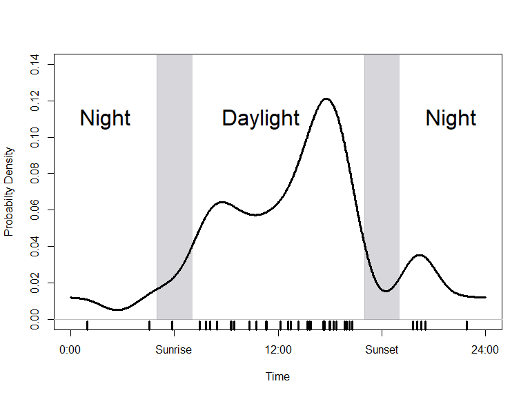

``` r
library(Diel.Niche)
library(overlap)
#> This is overlap devel version 0.3.4.
#> For overview type ?overlap; for changes do news(p='overlap').
```

``` r

# Consider a set of observed detections in time from a species detected by camera traps.
y.radians=c(2.4315927, 2.1048671, 2.4190263, 1.1938052, 3.1792918, 2.1111503, 3.2861059, 3.9269908, 5.1836279, 4.1531855, 4.2223005, 5.3721234, 3.9835395, 3.6191147, 3.3363714, 5.2464597, 2.9719467, 3.4494687, 5.3092916, 3.9332740,  6.0004420, 3.8327430, 2.2179644, 4.1783182, 2.8148670, 2.4755750, 3.9144244, 2.0420352, 0.2513274, 1.5393804, 4.0212386, 3.8201767, 3.8264599, 4.2662828, 3.6316811, 3.5876988, 1.9540706, 3.8453094, 2.9593803, 2.7017697)

# Create a plot and add the smoothed fit a non-parametric kernel density estimator
densityPlot(y.radians, extend=NULL, lwd=4,main="",col="white",xaxt="none",
            ylab="Probabilty Density",ylim=c(0,0.14))

axis(1, at=c(0,6,12,18,24),lab=c("0:00","Sunrise","12:00","Sunset","24:00"))
x <- c(5,7,7,5)
y <- c(0, 0, 1, 1) # The y-coordinate of the vertices
polygon(x, y, col="#80809052", border = "#80809052")

x <- c(17,19,19,17)
y <- c(0, 0, 1, 1) # The y-coordinate of the vertices
polygon(x, y, col="#80809052", border = "#80809052")

text(11,0.11,"Daylight",cex=2)
text(2,0.11,"Night",cex=2)
text(22,0.11,"Night",cex=2)
kernel.out=densityPlot(y.radians,extend = NULL,main="",lwd=3,rug=TRUE,add=TRUE,n.grid=1000)
```



We can use the Diel.Niche package to help classify the hypothesis that
is most supported from this analysis. To do so, we need to integrate
under the curve at the intervals along the x-axis that correspond to the
diel periods (twilight, daytime, nighttime). First, notice that n.grid
is set to 1000, so we have many evaluations of the probability density
along the curve; the higher this number, the more accurate the
integration will be. Second, to separate the diel periods, we need to
know the time periods of dawn and dusk. Below, we assume a one hour
period for dawn between 6-7am and dusk between 17-18pm.

``` r
#Using the object kernel.out, we integrate under the curve to estimate the three probabilities
prob.integrated=prob.Overlap(kernel.out,
                             dawn=c(6,7),
                             dusk=c(17,18))
prob.integrated
#>           p.twi     p.day   p.night
#> [1,] 0.05542409 0.7480305 0.1936513

#We then pass the probabilities to this function to classify the hypothesis that is most supported under the Tradititional hypothesis set
posthoc.niche(prob.integrated,hyp.sets("Traditional"))
#>        p.twi     p.day   p.night             Hypothesis
#> 1 0.05542409 0.7480305 0.1936513 Cathemeral Traditional
```

Our result indicates that the Cathemeral Traditional hypothesis is most
supported. This may have been unintuitive simply by looking at the
kernel density plot. While there is a large amount of activity during
the daytime, the probability of nighttime use is also quite high at
0.194, thus supporting the Cathemeral designation.

If we use the Maximizing hypothesis set, we find out that the Diurnal
Max hypothesis is most supported.

``` r
posthoc.niche(prob.integrated,hyp.sets("Maximizing"))
#>        p.twi     p.day   p.night  Hypothesis
#> 1 0.05542409 0.7480305 0.1936513 Diurnal Max
```

Lastly, by evaluating the same kernel density result using the General
hypothesis set, we find that the most supported hypothesis is more
specifically the ‘Diurnal-Nocturnal’ hypothesis.

``` r
posthoc.niche(prob.integrated,hyp.sets("General"))
#>        p.twi     p.day   p.night        Hypothesis
#> 1 0.05542409 0.7480305 0.1936513 Diurnal-Nocturnal
```

By defining the diel hypotheses a priori and explicitly, we can more
accurately make inference based on a given objective. approximations.
Visually, the above kernel density plot shows this animal is most active
during the daytime, which is confirmed with the Diurnal Max hypothesis
being most supported in the Maximizing hypothesis set. However,
considering more traditional definitions of diel activity, we should
call the animal cathemeral, given it’s support under the Cathemeral
Traiditonal hypothesis. More so, if we want to make a clear deliniation
between activity at two diel periods versus three diel periods, the
General hypothesis set makes it evident the species is mostly active
during only two diel periods, as supported by the Diurnal-Nocturnal
hypothesis.
