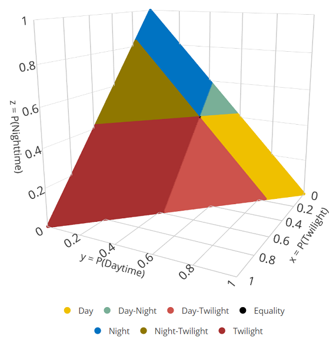
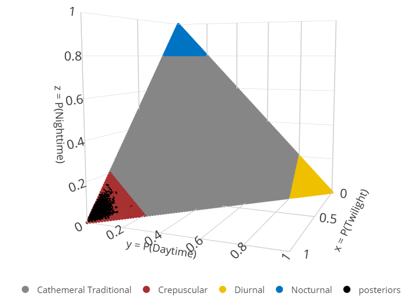

# Diel.Niche

An R package to evaluate hypotheses of diel phenotypes based on empirical
data and estimate the probabilitiy of activity during the crepuscular,
daytime, and nighttime periods. The main idea of evaluating diel phenotypes as hypotheses is that they can be expressed as inequality
statements among the these three probabilities of activity. The core modeling and estimation functions of this packages are wrapper 
functions to gibbs MCMC algorithms provided by the R package $\texttt{multinomineq}$: [https://www.dwheck.de/software/multinomineq/](https://www.dwheck.de/software/multinomineq/).

The main package vignettes can be on Github here: [Main Vignette](./GitHub_vignettes/Diel-Niche-vignette.md), [Additional Vignette](./GitHub_vignettes/Diel-Niche-Additional.md)

Case study example vignette's can be found on Github here: [Example 1](./GitHub_vignettes/Example1.md), [Example 2](./GitHub_vignettes/Example2.md), [Example 3](./GitHub_vignettes/Example3.md), [Example 4](./GitHub_vignettes/Example4.md), and
and [Example5 ](./GitHub_vignettes/Example5.md).


## Install

First, install and load the library

``` r
# Install package from GitHub via the devtools package.
# devtools::install_github("diel-project/Diel-Niche-Modeling",
#                         ref="main",
#                         build_vignettes = TRUE
# )

# Load the pacakge
  library(Diel.Niche)

# You can view the main vignette as
  vignette("Diel-Niche-Vignette")

# Or other vignette's
  vignette("Example1")
  vignette("Example2")
  vignette("Example3")
  vignette("Example4")

# To list all the available vignette's for the package
  browseVignettes("Diel.Niche")

# Listing the packages functions and help files

  help(package="Diel.Niche")


```

## Hypotheses

There are four fundamental hypothesis sets: *Maximizing*,
*Traditional*, *General*, and *Selection*. Additional hypotheses available are
described in the ‘Diel-Niche-Vignette.Rmd’

### **Maximizing**

This hypothesis set includes three hypotheses (Crepuscular Max, Diurnal
Max, and Nocturnal Max) with the objective to evaluate which time period
is used most. As such, there is no hypothesis about activity across
multiple time periods (i.e., cathemeral).

``` r
triplot(hyp=hyp.sets("Maximizing"))
```


### **Traditional**

This hypothesis set includes four hypotheses (Crepuscular, Diurnal,
Nocturnal, Traditional Cathemeral) that aim to capture the general
interpretation of these hypotheses from the literature. Crepuscular,
Diurnal, and Nocturnal are defined based on having at least 0.80
probability (threshold probability, $\xi_{1} = 0.80)$ in their
respective diel periods (twilight, daytime, nighttime). If an animal is
not mostly active in one period than it is defined as Traditional
Cathemeral; this occurs when either two or three time periods are used
more than $1-\xi_{1}$.

``` r
triplot(hyp=hyp.sets("Traditional"))
```


### **General**

This hypothesis set includes seven hypotheses. The Diurnal, Crepuscular,
and Nocturnal hypotheses are defined the same as in Traditional. The
main difference is the separation of the probability space of
Traditional Cathemeral into four more specific hypotheses: General
Cathemeral, Crepuscular-Nocturnal, Diurnal-Nocturnal, and
Diurnal-Crepuscular. The General Cathemeral hypothesis—which represents
a subset of the parameter space taken by the previously mentioned
Traditional Cathemeral—aims to define when an animal uses all three diel
periods (twilight, daytime, nighttime) at equal to or more than a
minimum amount (i.e.,
$p_{\text{tw}}, p_{\text{d}}, p_{\text{n}} \leq \xi_{1}$ and
$p_{\text{tw}}, p_{\text{d}}, p_{\text{n}} \geq \xi_{2}$). We defined
the lower threshold probability as $\xi_{2} = 0.10$, such that we
consider it important to differentiate animal activity when a diel
period is used at least this much. However, if only two diel periods are
used above $\xi_{2}$ then we classify this activity using one of the
binomial hypotheses (Crepuscular-Nocturnal, Diurnal-Nocturnal, and
Diurnal-Crepuscular).

``` r
triplot(hyp=hyp.sets("General"))
```


### **Selection**

The \emph{Selection} hypothesis set includes seven diel phenotype hypotheses (Figure~\ref{fig:selection}) that are defined based on the inputted 
(i.e., not estimated) amount of proportional time available to an animal in each diel period ($\mathbf{p}_{\text{avail}} = [p_{\text{av.tw}},\;p_{\text{av.d}}]$); 
the available time in the night period is derived as, $1 - p_{\text{av.tw}} - p_{\text{av.d}}$. The amount of time available in each diel period will depend on 
the day of the year and location of sampling. Each hypothesis is defined based on a single diel period or multiple diel periods being used greater than available. 
For example, diurnal selection occurs when $\frac{p_{\text{d}}}{p_{\text{av.d}}} > 1$ and $\frac{p_{\text{tw}}}{p_{\text{av.tw}}}, \frac{p_{n}}{p_{\text{av.n}}} \leq 1$. 


``` r
triplot(hyp=hyp.sets("Selection"), diel.setup=diel.ineq(p.avail=c(0.04,0.48))
```




### Hypothesis Codes

Data simulation, model fitting, and plotting are done based on a
hypothesis or set of hypotheses. Users don’t need to remember hypothesis
codes, but can call them as,

``` r
  hyp.sets("Maximizing")
```

    ## [1] "D.max"  "N.max"  "CR.max"

``` r
  hyp.sets("Traditional")
```

    ## [1] "D"  "N"  "CR" "C"

``` r
  hyp.sets("General")
```

    ## [1] "D"    "N"    "CR"   "C2"   "D.CR" "D.N"  "CR.N"


``` r
  hyp.sets("Selection")
```

    ## [1] "D.avail"    "CR.avail"   "N.avail"    "EQ.avail"   "D.CR.avail" "N.CR.avail" "D.N.avail"


# Simulating Data

Pick a hypothesis to simulate data from and how many samples,

``` r
  set.seed(45451)
  hyp <- c("CR")
  sim <- sim.diel(hyp=hyp,n.sample=100)
  
  #The probability value used to simulate data
  p <- sim$p
  p
```

    ##       [,1]  [,2] [,3]
    ## [1,] 0.935 0.025 0.04

``` r
  #The simulated data
  y <- sim$y
  y
```

    ##      y_crep y_day y_night
    ## [1,]     96     1       3

# Model Comparison

Models are compared using Bayes factors, which are used to derive a
posterior model probability

``` r
  hyp.set <- hyp.sets("Traditional")
  out <- diel.fit(y,hyp.set)
```

    ## Data checks Complete.

    ## Calculating Bayes Factors...

    ## The most supported model is: 
    ##  Crepuscular (Traditional)

``` r
#Call the model probabilities for each hypothesis in the set
  out$bf.table
```

    ##    Prior Posterior
    ## D   0.25         0
    ## N   0.25         0
    ## CR  0.25         1
    ## C   0.25         0

The function ‘diel.fit’ defaults to providing the model probabilities
for each hypothesis set, but not the posterior samples of the parameters
for each hypothesis. We can change this as well as include additional
MCMC chains,

``` r
  out <- diel.fit(y,hyp.set,n.chains = 2,post.fit = TRUE)
```

    ## Data checks Complete.

    ## Calculating Bayes Factors...

    ## Posterior Sampling...

    ## The most supported model is: 
    ##  Crepuscular (Traditional)

We can look at a convergence criteria for the most supported model.

``` r
  out$ms.gelm.diag
```

    ## Potential scale reduction factors:
    ## 
    ##      Point est. Upper C.I.
    ## p1_1          1       1.01
    ## p1_2          1       1.01

We can plot the posterior samples from the most supported model to check
convergence/mixing as,

``` r
 plot(coda::as.mcmc(out$post.samp.ms.model))
```

<!-- -->

The posterior samples for all hypotheses are available in a list.

``` r
 names(out$post.samp)
```

    ## [1] "D"  "N"  "CR" "C"

``` r
#For each of these list is a list of chains
  length(out$post.samp[[1]])
```

    ## [1] 2

``` r
#Here are the means of the posterior samples of all hypotheses for chain 1
  lapply(out$post.samp,FUN=function(x){colMeans(x[[1]])})
```

    ## $D
    ##    p_crep_1     p_day_1   p_night_1 
    ## 0.190235520 0.801957493 0.007806987 
    ## 
    ## $N
    ##  p_crep_1   p_day_1 p_night_1 
    ## 0.0000000 0.1254649 0.8745351 
    ## 
    ## $CR
    ##   p_crep_1    p_day_1  p_night_1 
    ## 0.94286797 0.01899454 0.03813750 
    ## 
    ## $C
    ##   p_crep_1    p_day_1  p_night_1 
    ## 0.78993613 0.06946899 0.14059487

# Plotting

Using the packages bayesplot and ggplot2, we can examine our posterior
distributions along with the true probabilities values,

``` r
library(ggplot2)
library(bayesplot)
```

``` r
posteriors <- coda::as.mcmc(out$post.samp.ms.model)

plot_title <- ggtitle("Posterior distributions",
                      "with medians and 80% intervals")
mcmc_areas(posteriors, prob = 0.8) + plot_title+ 
  geom_vline(xintercept=p[1], linetype="dashed",color = c("red"), linewidth=1)+
  geom_vline(xintercept=p[2], linetype="dashed",color = c("purple"), linewidth=1)+
  geom_vline(xintercept=p[3], linetype="dashed",color = c("green"), linewidth=1)
```

<!-- -->

We can also plot the posteriors in 3D using ploty.

``` r
triplot(out)
```



# Plotting Issues in RStudio

Plotting is done using the package plotly. Plotly can have issues with
RStudio. If you are using RStudio and no figures are opening then:
Tools–\>Global Options–\>Advanced–\>Rendering Engine Choose “Desktop
OpenGL{} and then restart RStudio.

# Badges

[](https://opensource.org/licenses/)

# Acknowledgements

- The many data contributors that supported the evaluation of this framework.

# Authors

- [Brian Gerber](https://github.com/bgerber123)
- [Kadambari Devarajan](https://github.com/kadambarid)
- [Mason Fidino](https://masonfidino.com/)
- [Zach Farris](https://hes.appstate.edu/faculty-staff/zachary-farris)

If you are interested in contributing, see [Contributor Guidelines](CONTRIBUTING.md)