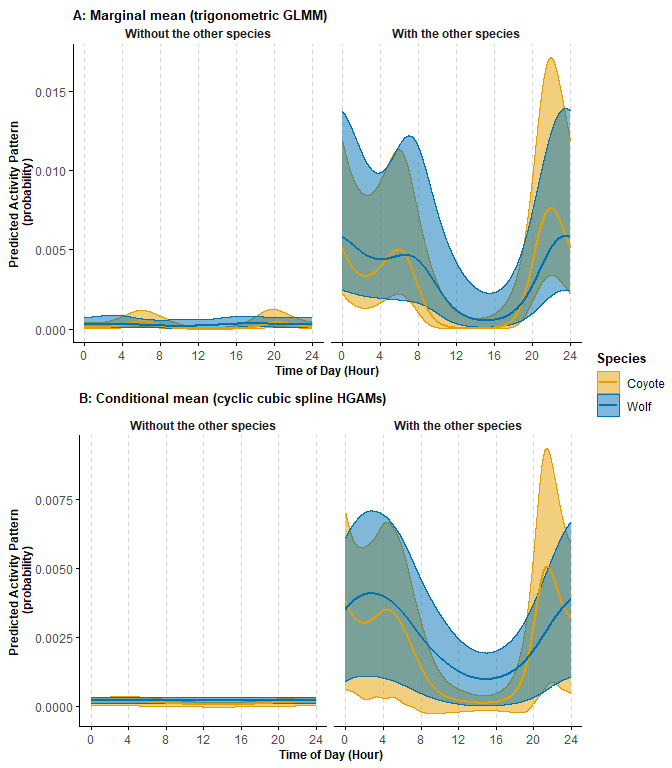

# Hierarchical models to estimate animal diel activity, diel phenotype, and activity overlap between species
#### Authors: Brian D. Gerber, Fabiola Iannarilli, and John Fieberg
#### Data provided by Fabiola Iannarilli, John Fieberg, and John Erb
#### Date: 2024-12-02


## Introduction

[Iannarilli et al. 2024](https://doi.org/10.1111/1365-2656.14213) describe two hierarchical modeling approaches relevant for estimating a species' diel activity throughout the 24-hr light-dark cycle. This vignette aims to connect those approaches to the diel phenotypes defined in the [Diel.Niche](https://github.com/diel-project/Diel-Niche-Modeling) R package and to demonstrate how to estimate diel activity overlap between species' predicted activity throughout the 24-hour cycle. Activity overlap is commonly estimated via the circular non-parametric methods of [Ridout and Linkie, 2009](https://link.springer.com/article/10.1198/jabes.2009.08038) and implemented in the R package [overlap](https://cran.r-project.org/web/packages/overlap/index.html). However, we can also achieve this objective using outputs from the parametric diel activity models described by [Iannarilli et al. 2024](https://doi.org/10.1111/1365-2656.14213).

#### Objectives

- fit hierarchical diel activity models (trigonometric and cyclic cubic splines) and use predictions to define the diel phenotypes of coyotes and wolves.

- estimate the temporal overlap between coyotes and wolves using predictions from hierarchical diel activity models

**Note:** The code and data to create the inputs used here and the R markdown files can be directly downloaded [here](diel.hierarchical.data.code.zip).


## Setup

We start with already compiled data relevant for fitting hierarchical activity models. The camera-trapping data and code used here are modified from Chapter 7 of the tutorial for [A ‘How-to’ Guide for Estimating Animal Diel Activity Using Hierarchical Model](https://hms-activity.netlify.app/). Specifically, the data we use are from summer (May, June, July) of 2016, 2017, and 2018 on coyotes and wolves detected in Minnesota, USA. 


**Load libraries and data object**

```{.r .fold-hide}
  library(dplyr) 
  library(GLMMadaptive)
  library(mgcv)
  library(forcats)
  library(MESS)
  library(ggplot2)
  library(ggpubr)
  library(overlap)
  library(Diel.Niche)
  library(suncalc)
  library(lubridate)
  load("coywolf.data.summer.RData")
```

The data objects we will work with are `occasions_Co_cbind` (coyote data) and  `occasions_Wo_cbind` (wolf data), which include the *site*, *time* (by hour), and whether the species was detected (*success*) or not (*failure*) summarized across many days. Lastly, the *oth_sp* column indicate whether the other species was observed to be present at that site or not. So for the data set `occasions_Co_cbind`, the detections are of coyotes and the *oth_sp* indicates whether a wolf was observed at each site.


### Coyote Data
Header and frequency of detections across sites and hours of the day


```{.r .fold-hide}
  head(occasions_Co_cbind)
```

```
## # A tibble: 6 × 5
## # Groups:   site, Time [6]
##   site   Time oth_sp success failure
##   <fct> <int> <fct>    <dbl>   <dbl>
## 1 10A       0 0            0      54
## 2 10A       1 0            0      54
## 3 10A       2 0            0      54
## 4 10A       3 0            0      54
## 5 10A       4 0            0      54
## 6 10A       5 0            0      54
```

```{.r .fold-hide}
  table(occasions_Co_cbind$success)
```

```
## 
##    0    1    2    4 
## 2070   35    6    1
```

### Wolf Data
Header and frequency of detections across sites and hours of the day


```{.r .fold-hide}
  head(occasions_Wo_cbind)
```

```
## # A tibble: 6 × 5
## # Groups:   site, Time [6]
##   site   Time oth_sp success failure
##   <fct> <int> <fct>    <dbl>   <dbl>
## 1 10A       0 0            0      54
## 2 10A       1 0            0      54
## 3 10A       2 0            0      54
## 4 10A       3 0            0      54
## 5 10A       4 0            0      54
## 6 10A       5 0            0      54
```

```{.r .fold-hide}
  table(occasions_Wo_cbind$success)
```

```
## 
##    0    1    2    3 
## 2064   41    6    1
```

## Model Fitting

### Trigonmeteric 

We will first fit hierarchical trigonometric models to the coyote and wolf data that includes the other species (*oth_sp*) as a covariate and *site* as a random effect.


``` r
# Fit coyote model
  mod_trig_Co <- mixed_model(fixed = cbind(success, failure) ~ cos(2*pi*Time/24)*oth_sp + 
                                                               sin(2*pi*Time/24)*oth_sp +
                                                               cos(2*pi*Time/12)*oth_sp + 
                                                               sin(2*pi*Time/12)*oth_sp, 
                             random = ~ 1 | site,
                             family = binomial(),
                             data = occasions_Co_cbind,
                             iter_EM = 0
                             ) 

# Fit wolf model
  mod_trig_Wo <- mixed_model(fixed = cbind(success, failure) ~ cos(2*pi*Time/24)*oth_sp + 
                                                               sin(2*pi*Time/24)*oth_sp +
                                                               cos(2*pi*Time/12)*oth_sp + 
                                                               sin(2*pi*Time/12)*oth_sp, 
                             random = ~ 1 | site,
                             family = binomial(),
                             data = occasions_Wo_cbind,
                             iter_EM = 0
                             ) 
```

We can now predict the temporal activity for both coyotes and wolves in the presence and absence of the other species. We focus on estimating marginal mean activity patterns because our aim is to compare between two groups that differ in their characteristics (i.e. site-sessions with and without the other species). This is done bet setting the argument `marginal` in the `effectPlotData` function equal to `TRUE`.


``` r
# We want many prediction points within the 24-hr period so that we can summarizing 
# probabilities within twilight, daytime, and nightime well. This will be used by the
# Diel.Niche package
  num.pred.points=24*500

# Coyote
  newdat <- with(occasions_Co_cbind, expand.grid(Time = seq(min(Time), 24, length.out = num.pred.points), 
                                                 oth_sp = as.factor(c(0,1))
                                                 )
                 )
  cond_eff_Co <- effectPlotData(mod_trig_Co, newdat, marginal = TRUE)
  cond_eff_Co$Species <- "Coyote"

# Wolf
  newdat <- with(occasions_Wo_cbind, expand.grid(Time = seq(min(Time), 24, length.out = num.pred.points), 
                                                 oth_sp = as.factor(c(0,1))
                                                 )
                 )
  cond_eff_Wo <- effectPlotData(mod_trig_Wo, newdat, marginal = TRUE)
  cond_eff_Wo$Species <- "Wolf"

  cond_eff <- rbind(cond_eff_Co, cond_eff_Wo) %>% 
  mutate(oth_sp_labels = fct_recode(oth_sp, "Without the other species" = "0", "With the other species" = "1"))
```


### Cyclic cubic spline 

Next, we fit cyclic cubic spline hierarchical generalized additive models (without a site-specific smoother) for each species and predict temporal activity.


``` r
# Coyote
# Model fitting
  mod_cycl_Co <- bam(cbind(success, failure) ~ s(Time, bs = "cc", k = 12, by = oth_sp, m = 1) +
                                                oth_sp + 
                                                s(site, bs="re"), 
                     knots = list(Time=c(0,23)),
                     family = "binomial", 
                     data = occasions_Co_cbind
                     )

# Wolf
# Model Fitting  
  mod_cycl_Wo <- bam(cbind(success, failure) ~ s(Time, bs = "cc", k = 12, by = oth_sp, m = 1) +
                                                oth_sp + 
                                                s(site, bs="re"), 
                     knots = list(Time=c(0,23)),
                     family = "binomial", 
                     data = occasions_Wo_cbind
                     )
```

Next, we can predict temporal activity from each model.


``` r
# Coyote Predictions
  newdat <- with(occasions_Co_cbind, expand.grid(Time = seq(0, 24, length.out= num.pred.points), 
                                               oth_sp = as.factor(c(0,1)), 
                                               site = "10E" #Site doesn't matter
                                                  ) 
                 ) 

  cycl_pred_Co <- predict.bam(mod_cycl_Co, 
                              newdata = newdat,  
                              exclude = "s(site)", 
                              se.fit = TRUE, 
                              type = "response"
                              ) 
  cycl_pred_Co <- cbind(newdat, 
                        fit=cycl_pred_Co$fit, 
                        se.fit=cycl_pred_Co$se.fit, 
                        Species = "Coyote"
                        )
 
# Wolf Predictions
  newdat <- with(occasions_Wo_cbind, expand.grid(Time = seq(0, 24, length.out= num.pred.points), 
                                                 oth_sp = as.factor(c(0,1)), 
                                                 site = "10E" #Site doesn't matter
                                                 )
                 ) 
  
  cycl_pred_Wo <- predict.bam(mod_cycl_Wo, 
                              newdata = newdat,  
                              exclude = "s(site)", 
                              se.fit = TRUE, 
                              type = "response"
                              ) 
  cycl_pred_Wo <- cbind(newdat, 
                        fit=cycl_pred_Wo$fit, 
                        se.fit=cycl_pred_Wo$se.fit, 
                        Species = "Wolf"
                        )
# Combine results  
  cycl_pred <- rbind(cycl_pred_Co, cycl_pred_Wo) %>% 
  mutate(oth_sp_labels = fct_recode(oth_sp, "Without the other species" = "0", "With the other species" = "1"))
```

## Diel Activity Plots


```{.r .fold-hide}
pl_cycl <- ggplot(cycl_pred, aes(Time, fit, color=Species, group=Species)) +
  geom_ribbon(aes(ymin=fit-1.96*se.fit, ymax=fit+1.96*se.fit, fill=Species), alpha=0.5, size = 0.25) +
  geom_line(linewidth = 1) +
  labs(x = "Time of Day (Hour)", y = "Predicted Activity Pattern \n (probability)", title = "B: Conditional mean (cyclic cubic spline HGAMs)")+
  scale_color_manual(values = c("#E69F00", "#0072B2")) +
  scale_fill_manual(values = c("#E69F00", "#0072B2")) +
  theme_minimal()+
  theme(legend.position = "none",
        plot.title = element_text(size=10,face="bold"),
        axis.line = element_line(colour = 'black', linetype = 'solid'),
        axis.ticks = element_line(colour = 'black', linetype = 'solid'),
        axis.title = element_text(size=9,face="bold"),
        panel.grid.minor.y = element_blank(),
        panel.grid.major.y = element_blank(),
        panel.grid.major.x = element_line(colour = 'lightgrey', linetype = 'dashed', linewidth = 0.5),
        panel.grid.minor.x = element_blank(),
        strip.text = element_text(face = "bold")
        ) +
  scale_x_continuous(breaks=seq(0,24,4), labels=seq(0,24,4)) +
  facet_wrap(~oth_sp_labels, scales = "fixed")

pl_trig2 <- pl_trig + labs(title = "A: Marginal mean (trigonometric GLMM)") + theme(legend.position = "none", plot.title = element_text(size=10,face="bold", hjust = 0))
ggarrange(pl_trig2, pl_cycl, nrow = 2, ncol = 1, common.legend = TRUE, legend = "right")
```


<br>

First, we see that the trigonometric and the cyclic cubic spline hierarchical models return the same general pattern (compare plots within a column). Second, there is also quite a difference in the overall activity levels for coyotes and wolves at sites where they do not occur together and where they are observed to co-occur (compare y-axis of first column plots to second column plots). 

At sites they co-occur (second column plots), there is a high degree of similarity in the species' 24-hr temporal activity during the summer. Largely, both species have a peak in activity near twilight and a dip of activity during the middle of the daylight period.


## Diel Niche 
 
We will now use the Diel.Niche package to define each species' diel phenotype to confirm what we should call their activity type and see if its the same for each species. Below, we will focus on the results of only sites where the species co-occur.
 

### Data Organization

We first want to organize the activity predictions and then scale them by the area under the curve such that we can extract the relative probability of activity in twilight, daytime, and nighttime (these are used by the Diel.Niche package).


``` r
index.interval=(nrow(cond_eff_Wo)/2+1):nrow(cond_eff_Wo)
trig.preds = data.frame(wolf.with.coyote = plogis(cond_eff_Wo$pred[index.interval]),
                        coyote.with.wolf = plogis(cond_eff_Co$pred[index.interval])
)

Time = cond_eff_Wo$Time[index.interval]
```


``` r
ccs.preds = data.frame(wolf.with.coyote = cycl_pred_Co$fit[index.interval],
                       coyote.with.wolf = cycl_pred_Wo$fit[index.interval]
)
```

### Scaling

Next, we need to standardize the predicted activity levels. Meaning, we need to remove differences in activity due to variation in the frequency of site use (y-axis of diel activity curve plots). We can standardize by the area under the curve.


``` r
  scale.values1 = apply(trig.preds,2,FUN=function(x){MESS::auc(Time,x)})
  trig.preds.scaled <- data.frame(t(apply(trig.preds, 1, function(x) x / scale.values1)))
  trig.preds.scaled$Time <- Time
  
  scale.values2 = apply(ccs.preds,2,FUN=function(x){MESS::auc(Time,x)})
  ccs.preds.scaled <- data.frame(t(apply(ccs.preds, 1, function(x) x / scale.values2)))
  ccs.preds.scaled$Time = Time
  
#Test auc is one
  apply(trig.preds.scaled,2,FUN=function(x){MESS::auc(Time,x)})
```

```
## wolf.with.coyote coyote.with.wolf             Time 
##                1                1              288
```

``` r
  apply(ccs.preds.scaled,2,FUN=function(x){MESS::auc(Time,x)})
```

```
## wolf.with.coyote coyote.with.wolf             Time 
##                1                1              288
```

Next, we need to define each predicted time period throughout the 24-hr cycle into the the diel periods of twilight, daytime, and nightime (in this order) to be used in the Diel.Niche package. 


Since the data are summarized across a three month period, we want to extract the sun position according to the roughly the middle of the time period of our data (June).


``` r
# Extract sunrise and sunset times for the general study area and period. 
  sun.times <- getSunlightTimes( date = as.Date("2016-06-1"), 
                      lat = 47.6211944 , lon = -093.4404444, data = NULL, 
                      keep = c("dawn", "dusk", "nightEnd", "night"), 
                      tz = "America/Chicago")

# Define the periods of dawn and dusk
  dawn <- c(hour(sun.times$nightEnd)+minute(sun.times$nightEnd)/60,
           hour(sun.times$dawn)+minute(sun.times$dawn)/60)
    
  dusk <- c(hour(sun.times$dusk)+minute(sun.times$dusk)/60,
           hour(sun.times$night)+minute(sun.times$night)/60)
```

We can now extract the area under each predicted activity curve to get the probabilities of twilight, daytime, and nighttime. First, we will focus on the coyote...


``` r
diel.probs.coyote=Diel.Niche::prob.overlap(data.frame(x=trig.preds.scaled$Time,
                                                      y=trig.preds.scaled$coyote.with.wolf),
                                           dawn=dawn,
                                           dusk=dusk
                                          )
# Use the diel niche package to extract the associated diel phenotype within the Traditional hypothesis set  
diel.out.coyote <- Diel.Niche::posthoc.niche(diel.probs.coyote, hyp= hyp.sets("Traditional"))
```

Now, we do the same procedure for the wolf...


``` r
diel.probs.wolf=Diel.Niche::prob.overlap(data.frame(x=trig.preds.scaled$Time,
                                                    y=trig.preds.scaled$wolf.with.coyote),
                                           dawn=dawn,
                                           dusk=dusk
                                          )
# Use the diel niche package to extract the associated diel phenotype within the Traditional hypothesis set  
diel.out.wolf <- Diel.Niche::posthoc.niche(diel.probs.wolf, hyp= hyp.sets("Traditional"))
```

**Putting our results together**:


```{.r .fold-hide}
  data.frame(species=c("Coyote","Wolf"),rbind(diel.out.coyote,diel.out.wolf))
```

```
##   species     p.twi     p.day   p.night             Hypothesis
## 1  Coyote 0.3435784 0.4992269 0.1565713 Cathemeral Traditional
## 2    Wolf 0.2859741 0.5316727 0.1818318 Cathemeral Traditional
```

We find that coyotes and wolves have quite similar probabilities of relative activity in the three diel periods and that they are both classified as  `Cathemeral` under the Traditional hypothesis set. 


## Overlap Estimation

Our above results demonstrate the similarity in the  absolute (from hierarhical models) and relative activity probabilities (from Diel.Niche) and the diel phenotypes of the wolf and coyote (from Diel.Niche). But, what if you want to estimate a measure of overlap in their diel activity using results from the hierarchical activity models. 

We can do that using the scaled diel predictions with the overlapTrue function from the R package `overlap`.


``` r
# Overlap using trigonometric models
#   Mean estimate of diel activity overlap between the wolf and coyote when
#   they are observed to occur at the same sites.
overlap::overlapTrue(trig.preds.scaled$wolf.with.coyote,
                     trig.preds.scaled$coyote.with.wolf)
```

```
## [1] 0.8153932
```


``` r
#Overlap using cyclic cubic spline models
#   Mean estimate of diel activity overlap between the wolf and coyote when
#   they are observed to occur at the same sites.
overlap::overlapTrue(ccs.preds.scaled$wolf.with.coyote,
                     ccs.preds.scaled$coyote.with.wolf)
```

```
## [1] 0.8171848
```

We see that the two modeling approaches generally agree with near 0.82 probability of diel activity overlap between these species.

## Uncertainty

We reccomend bootstrapping to get measures of uncertainty in the diel phenotype classification and measures of overlap when using the hierarchical model predictions. The procedure to do so are: 1) resample the coyote and wolf data separately, fit each to a model, predict overlap and diel phenotype, and repeat many times. Once this is done, find the quantiles of the predicted overlap to be used as confidence intervals.

<br>
