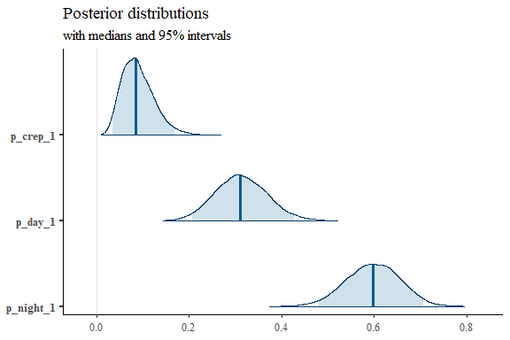
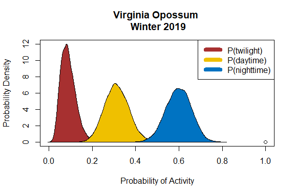

# Single Data Analysis Unit

#### Author: Brian D. Gerber

#### Date: 2023-05-10

The primary objective of the Diel.Niche package is to be able to use
observations of wild animals to estimate support for a set of diel niche
hypotheses. The fundamental data analysis unit is a set of three
frequencies (**y**): the number of observations of a species during
twilight, daytime, and nighttime (in that order). In this vignette, we
will demonstrate the basic functionality of the package. This
includes 1) model comparison, 2) parameter estimation, 3) posterior
predictive check, and 4) results visualization.

We will use data available in the package (‘diel.data’) provided by the
Urban Wildlife Information Network
(<https://www.urbanwildlifeinfo.org/>). The specific data are camera
trap detections of the Virginia Opossum (*Didelphis virginiana*) during
the winter of 2018. The available data are aggregated independent counts
from 131 camera locations in Chicago, Illinois USA. Our objective is to
evaluate the support for the traditional diel hypotheses of the Virginia
Opossum in an urban environment during the winter.

# The Setup

To start, we load the available packages and extract the specific data
of interest.

``` r
# Load packages
  library(Diel.Niche)
  library(lubridate)
#> 
#> Attaching package: 'lubridate'
#> The following objects are masked from 'package:base':
#> 
#>     date, intersect, setdiff, union
  library(coda)
  library(ggplot2)
#> 
#> Attaching package: 'ggplot2'
#> The following object is masked from 'package:Diel.Niche':
#> 
#>     last_plot
  library(bayesplot)
#> This is bayesplot version 1.10.0
#> - Online documentation and vignettes at mc-stan.org/bayesplot
#> - bayesplot theme set to bayesplot::theme_default()
#>    * Does _not_ affect other ggplot2 plots
#>    * See ?bayesplot_theme_set for details on theme setting

# Define a year variable
  diel.data$min_year = year(as.POSIXct(diel.data$min_date, format = "%m/%d/%Y"))

# Extract winter data in 2018 for the Virginia Opossum
  winter = subset(diel.data, season=="Winter" & min_year=="2018" & scientificName=="Didelphis virginiana")

# Visualize the data
  head(winter)
#>           scientificName twilight day night trap_nights nsite   min_date  max_date mean_lat mean_lon season       country   phylum    class           order      family             Project unit_type
#> 111 Didelphis virginiana        5  20    39        1616   131 12/29/2018 1/24/2019 41.87236 -87.8423 Winter United States Chordata Mammalia Didelphimorphia Didelphidae UWIN_Chicago_IL_USA     28day
#>          Common_name Activity_Literature min_year
#> 111 Virginia Opossum           Nocturnal     2018
```

For simplicity, we extract the count data and assign it to the object
`y`.

``` r
y=data.frame(twilight=winter$twilight,
             day=winter$day, 
             night=winter$night)
rownames(y)=winter$Common_name

y
#>                  twilight day night
#> Virginia Opossum        5  20    39
```

# Model Comparison and Parameter Estimation

We are now ready to compare models using the *Traditional* hypothesis
set, which includes four models: diurnal, nocturnal, crepuscular, and
Traditional Cathemeral. We can confirm that this is the hypothesis set
of interest by plotting the set together using the plot.diel function
as,

``` r
plot.diel(hyp=hyp.sets("Traditional"))
```

<!-- -->

To fit our data (`y`), we use the function ‘diel.fit’, specifying the
hypothesis set of interest and MCMC inputs.

``` r
out = diel.fit(y = as.matrix(y),hyp.set=hyp.sets("Traditional"),
             post.fit = TRUE, 
             n.chains = 3, n.mcmc=5000,burnin = 1000)
#> Data checks Complete.
#> Calculating Bayes Factors...
#> Posterior Sampling...
#> The most supported model is: 
#>  Cathemeral (Traditional)
```

The most supported model is Traditional Cathemeral. We can examine the
posterior model probabilities for all models as,

``` r
out$bf.table
#>    Prior Posterior
#> D   0.25         0
#> N   0.25         0
#> CR  0.25         0
#> C   0.25         1
```

which indicate that we are very certain that Traditional Cathemeral
(‘C’) is supported. Notice that without specifying a prior probabilty
for each model, it is assumed to be equal among the models.

# Checks

As long as we fit our model with multiple chains, we will get an
estimate of the Gelman-Rubin convergence diagnostic for our most
supported model, as

``` r
out$ms.gelm.diag
#> Potential scale reduction factors:
#> 
#>      Point est. Upper C.I.
#> p1_1          1          1
#> p1_2          1          1
```

Since the point estimate and upper intervals are at one, there is no
evidence that the parameters have not converged to their posterior
distributions. However, we should also plot the parameter chains to
visually inspect this (next section).

We can also examine whether there is evidenve of lack of it betweem our
most supported model and the data using a posterior predictive check,
which provides a probability of fit (‘ppp’). As long as this value is
not near 0 or 1 then there is no evidence of departure of fit to the
data.

``` r
out$ms.ppc
#>    X2_obs   X2_pred       ppp 
#> 1.9763237 2.0193886 0.5178333
```

This model indicates that it fits the data with a probability value of
NA.

# Visualizations

First, let’s plot our parameter chains to confirm that posterior
distributions are properly converged.

``` r
plot(coda::as.mcmc(out$post.samp.ms.model))
```

<!-- -->

We see that the chains are highly overlapping and thus confirm that
posterior distributions have converged.

Next, lets examine the posterior probabilities of activity in the three
diel periods,

``` r
# Plotting
  plot_title <- ggplot2::ggtitle("Posterior distributions",
                        "with medians and 95% intervals")
  bayesplot::mcmc_areas(out$post.samp.ms.model, prob = 0.95) + plot_title
```

<!-- -->

Alternatively, using base R to plot the same posteriors,

``` r
# Plotting
  plot(0,xlim=c(0,1),ylim=c(0,12),ylab="Probability Density", xlab="Probability of Activity",
       main="Virginia Opossum \n Winter 2019")
  polygon(density(out$post.samp.ms.model[,1]), col = "#A73030FF")
  polygon(density(out$post.samp.ms.model[,2]), col = "#EFC000FF")
  polygon(density(out$post.samp.ms.model[,3]), col = "#0073C2FF")
  legend("topright", legend=c("P(twilight)","P(daytime)","P(nighttime)"),lwd=8,
         col=c("#A73030FF","#EFC000FF","#0073C2FF"))
```

<!-- -->

Alternatively, we can use the plot.diel function in the Diel.Niche
package that uses plotly to output a 3d plot of the posterior samples on
top of the hypothesis set. We execute the ‘plot.diel’ function simply
using the generic function ‘plot’ as the objecti out from diel.fit has a
unique class identifier (diel).

``` r
plot(out)
```


The black dots are the entire posterior samples plotted within the
Traditional Cathemeral hypothesis. This point cloud shows us that the
Virginia Opossum is largely active during night and day. To look at the
posterior median and 95% credible intervals, we can extract these as,

``` r
apply(out$post.samp.ms.model,2,quantile, probs=c(0.025,0.5,0.975))
#>         p_crep_1   p_day_1 p_night_1
#> 2.5%  0.03434082 0.2079956 0.4815938
#> 50%   0.08525859 0.3113428 0.5986884
#> 97.5% 0.16860501 0.4279136 0.7071090
```

# Conclusions

What did we learn? We found that during the winter of 2018 in the urban
environment of Chicago, IL that there is strong evidence that the
Virginia Opossum is Cathemeral. Specifically, that the Opossum is active
most during the nighttime and the daytime.
