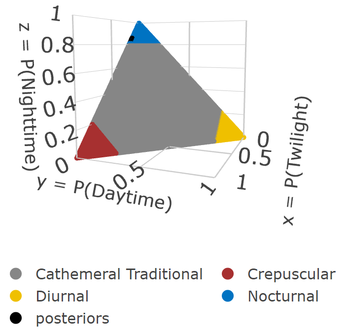

#### Author: Brian D. Gerber
#### Date: 2024-12-04


## 1. Large Sample Size


A common error occurs when using the `diel.fit` function when the sample size of the number of detections ($y$) is large and setting the argument `post.fit=TRUE` and the `hyp.set` argument to include multiple models (e.g., `hyp = hyp.set = hyp.sets("Traditional")`).

For example, lets say you are studying a common species and you have lots of spatial sampling (e.g., many unique camera trap sites). If the goal is to estimate the diel niche of the species across all camera sites for a given season, you would aggregate the independent detections into counts of twilight, daylight, and nighttime. This may lead to many detections per diel period and overall.


``` r
# Load packages
  library(Diel.Niche)
# Data
  y = t(matrix(c(542, 0, 2834)))
```

Note that there are large number of detections in the twilight and nighttime periods. We can expect to be highly certain when determining the diel phenotype.

If you fit these data with default settings there should be no errors.


``` r
out <- diel.fit(
                y,
                hyp.set = hyp.sets("Traditional"),
)
#> Data checks Complete.
#> Calculating Bayes Factors...
#> The most supported model is: 
#>  Nocturnal (Traditional)
```

However, if you ask the function to sample from the posterior distributions for all diel phenotype models, `post.fit = TRUE`, we encounter an error. 


``` r
diel.fit(
         y,
         hyp.set = hyp.sets("Traditional"),
         post.fit = TRUE
)
#> Data checks Complete.
#> Calculating Bayes Factors...
#> Posterior Sampling...
#> Error in if (any(prob < 0, prob > 1)) {: missing value where TRUE/FALSE needed
```

The reason for the error is that the function is attempting to sample from a posterior distribution in which the model constraints and the data are in contradiction. Simply, there is no support for the model and thus estimating posterior samples with the given constraints does not work. In other words, there is so much support for a single model that the other models being fit by default are not supported and thus there are issues with sampling from the posterior distributions. 

**What to do about this issue?**

We need to separate the process in determining the most supported model and that of estimating the posterior distributions. First, fit the model with `post.fit = TRUE` and `bf.fit = FALSE` (default settings). 


``` r
out <- diel.fit(
                  y,
                  bf.fit = TRUE,
                  hyp.set = hyp.sets("Traditional"),  
                  n.chains = 3,
                  post.fit = FALSE,
)
#> Data checks Complete.
#> Calculating Bayes Factors...
#> The most supported model is: 
#>  Nocturnal (Traditional)
```

We determined the most supported model to be "Nocturnal (Traditional)". The model name is stored in the object `out$ms.model`, which we can be used in the `diel.fit` function to sample from the posterior distributions of only this model and not all models within the Traditional hypothesis set.


``` r
out.post <- diel.fit(
                     y,
                     bf.fit = FALSE,
                     hyp.set = out$ms.model,  
                     n.chains = 3,
                     post.fit = TRUE,
)
#> Data checks Complete.
#> Posterior Sampling...

# posterior samples (first chain)
  head(out.post$post.samp$N[[1]])
#> Markov Chain Monte Carlo (MCMC) output:
#> Start = 1 
#> End = 7 
#> Thinning interval = 1 
#>       p_crep_1      p_day_1 p_night_1
#> [1,] 0.1613719 1.485125e-04 0.8384795
#> [2,] 0.1620361 9.738083e-05 0.8378665
#> [3,] 0.1538320 4.058697e-05 0.8461274
#> [4,] 0.1626211 1.863699e-04 0.8371925
#> [5,] 0.1618493 6.093089e-05 0.8380897
#> [6,] 0.1707529 3.733342e-04 0.8288738
#> [7,] 0.1513084 5.400314e-05 0.8486376
```
And we can also plot our posterior samples on top of the defined parameter space for all the traditional hypothesis phenotypes as..


``` r
triplot(hyp = hyp.sets("Traditional"),
        posteriors = out.post$post.samp$N[[1]],
        )
```



